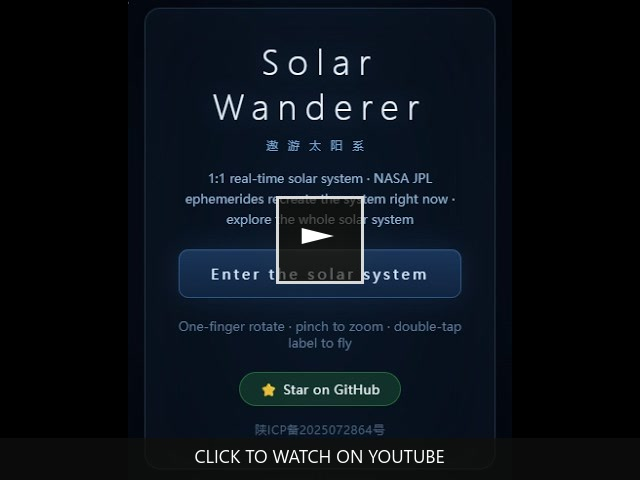

<div align="center">

# 🚀 遨游太阳系 · Solar Wanderer

**人类成为星际文明的第一站。**

一个基于真实 NASA JPL 星历的浏览器端 1:1 实时太阳系探索应用。手机、电脑、平板都能打开。

由真实 NASA JPL 星历驱动。行星此刻就在它们真实的位置上。

[](https://sw.icodestar.net)
[](README.md)
[](LICENSE)
[](https://threejs.org)
[](https://github.com/hyqzz/Solar-Wanderer/stargazers)

*无需安装 · 无需账号 · 无需后端 · 桌面与移动端通用 · 压缩后约 200 kB · MIT 开源*

<br>

### ▶ 演示视频

<a href="https://youtu.be/3rwShi6oF0o" title="在 YouTube 播放 Solar Wanderer 演示视频">
  
</a>

<br>

[](https://youtu.be/3rwShi6oF0o)

</div>

---

## 🌌 为什么这件事重要

我们从小就背会了八大行星的名字。但你真的“去过”那里吗？

市面上大多数太空应用让你在“科学准确”和“视觉震撼”之间二选一。遨游太阳系两者都要——它把真实的太阳系，每一颗行星、每一颗卫星、每一个天文单位，放进一个任何人都能免费打开的网页里。

我们的使命很简单：

> **在人类成为星际物种之前，我们必须先真正看见自己的后院。**

当一个孩子站在月球上，转过身，看见一颗小小的蓝色弹珠挂在漆黑的天空中时，有些东西会永远改变。当一个学生从地球一直缩放到奥尔特云，发现太阳系远比课本上的插图大得多时，他的尺度感会永久不同。当一个老师能在五分钟内带全班同学去一趟火星时，科学教育就被重新定义了。

这不仅仅是一个模拟器。这是一份**邀请**。

---

## ✨ 它有什么特别

| | 遨游太阳系 |
|---|---|
| **尺度** | 真 1:1 千米尺度——从脚下 0.5 米到 10 万 AU 的奥尔特云 |
| **精度** | 与 NASA JPL Horizons 对照：行星误差 ≤0.074°，21 颗卫星 10 天后 ≤0.22° |
| **沉浸感** | 从轨道 → 大气 → 地表 → 行走 → 水下，全程一镜到底，无加载、无切换 |
| **范围** | 从太阳到奥尔特云 · 小行星带 · 柯伊伯带 · 28 颗真实海外天体 · 4 颗彗星 · 旅行者号与日球层边界 |
| **全平台** | 桌面键鼠 + 完整移动触控——同一套物理，同一尺度 |
| **体积** | 压缩后约 200 kB JS · 无服务器 · 无 GPU 农场 |
| **开放** | MIT 协议 · 数据全部来自公开 NASA/IAU 源 · 可与 JPL Horizons 实时对账 |

---

## 🎯 未来方向：一起建造星际文明的第一站

遨游太阳系已经可用。但要让它达到“无法区分现实”的程度、被数十亿人看见，我们需要你的帮助。

我们正在围绕四大支柱前进：

1. **🪐 无法区分现实的逼真度**
   - 月球（LOLA）、火星（MOLA/HiRISE）、地球（SRTM）的真实 DEM 地形
   - 真实的日食、月食、行星食阴影
   - 动态天气、云层、尘暴、极光
   - 16K–32K 高分辨率贴图
   - 带有真实 3D 模型与任务历史的航天器

2. **🥽 身临其境的沉浸感**
   - WebXR / VR 支持
   - 第一人称宇航服 HUD
   - 环境叙事：阿波罗着陆点、火星车轨迹、地标
   - 真实的昼夜、季节、极昼极夜变化
   - 空间定向辅助与尺度参照物

3. **📚 全民科普教育系统**
   - 结构化导览课程
   - 多语言语音讲解
   - 教师/课堂/博物馆工具包
   - 实时天文事件模拟
   - 可扩展的科普内容中台

4. **🌍 让全世界知道**
   - 多语言支持
   - 视频、博客、SEO
   - 与学校、博物馆、天文馆、航天机构合作
   - 社区驱动的内容与翻译

**👉 查看完整主计划：** [`ROADMAP.md`](ROADMAP.md)

---

## 🙌 如何参与

我们欢迎各类贡献者：开发者、天文学家、教育工作者、翻译者、设计师、写作者、视频创作者、以及所有热爱宇宙的人。

### 快速开始

```bash
git clone https://github.com/hyqzz/Solar-Wanderer.git
cd Solar-Wanderer
npm install
npm run dev      # → http://localhost:5173
npm test         # 33 项离线精度测试
npm run verify   # 与 NASA JPL Horizons 实时对账（需联网）
```

### 最需要的贡献

| 领域 | 需求 | 适合新手？ |
|------|------|-----------|
| **真实地形** | USGS LOLA（月球）/ MOLA（火星）DEM 瓦片流式加载 | ⭐ 是 |
| **食影系统** | 日-月-地阴影锥体积 | 进阶 |
| **音效设计** | 太空无线电嘶嘶、地表脚步声、水下环境音 | ⭐ 是 |
| **翻译** | 中英已完成；需要日、西、法、阿等 | ⭐ 是 |
| **教育内容** | 导览课程、知识卡片、测验、教案 | ⭐ 是 |
| **VR / WebXR** | 沉浸式头显支持 | 进阶 |
| **精度扩展** | VSOP87 + ELP2000，支持 ±3000 年 | 进阶 |
| **书签功能** | 保存/恢复位置与时间 | ⭐ 是 |
| **航天器模型** | 旅行者、新视野、朱诺、卡西尼 3D 模型与轨迹 | ⭐ 是 |
| **宣传推广** | 博客、视频、社交媒体、学校合作 | ⭐ 是 |

**👉 查看 [Issues](https://github.com/hyqzz/Solar-Wanderer/issues)** — 我们正在把主计划拆解为可执行的任务。选一个，留言，加入进来。

请阅读 [CONTRIBUTING.md](CONTRIBUTING.md) 了解代码风格与 PR 流程。

---

## 🎮 立即体验

**[https://sw.icodestar.net](https://sw.icodestar.net)**

无需安装，无需账号，点开即玩。

**推荐第一次体验：**
1. 打开目录 → 点击 **月球** → 双指捏合到最近 → 降落 → 抬头：漆黑的夜空中挂着一颗蓝色地球。
2. 从地球一直缩远，直到行星变成小点，再直到奥尔特云出现。
3. 双击 **土星**，放大直到能看清环上的卡西尼缝。

---

## 🛠 技术栈

- Three.js 0.165 · Vite 5 · 原生 ESM · WebGL2 · 对数深度缓冲
- 纯函数星历层（可在 Node 中独立测试）
- 浮动原点渲染，支撑 1:1 千米尺度
- GPU 自适应分档，适配手机与低端设备

---

## 📊 精度

| 天体 | 与 NASA JPL Horizons 对照 |
|------|--------------------------|
| 九大行星 | 0.0007° – 0.074° |
| 月球 | 0.12°（截断 ELP） |
| 21 颗卫星 | 历元处 0° · 10 天后 ≤0.22° |
| 地球自转 | 子午线亚秒级精度 · 夏至倾角 23.4° · 1 恒星日 |

---

## 📣 帮忙传播

如果遨游太阳系让你感受到了一种“美好的渺小”，请：

- ⭐ 给本仓库点 star
- 🔗 分享 [sw.icodestar.net](https://sw.icodestar.net)
- 📺 制作一个视频或写一篇体验文章
- 🏫 告诉一位老师、学生或博物馆馆长

让我们一起，把太阳系变成人类真正熟悉的家园——并为迈向群星做好准备。

---

## 致谢

| | |
|---|---|
| **星历** | NASA JPL（*Standish 1992* 行星元素 · Horizons API 状态向量） |
| **贴图** | [Solar System Scope](https://www.solarsystemscope.com/textures/) CC-BY-4.0 · Steve Albers SOS · NASA JPL Photojournal（公共领域） |
| **自转模型** | IAU/WGCCRE 报告 |
| **亮星** | 依巴谷星表 |

---

<div align="center">

MIT © 2026 [hyqzz](https://github.com/hyqzz)

*Built with Three.js · 与 NASA JPL 验证 · Made to feel small*

</div>
