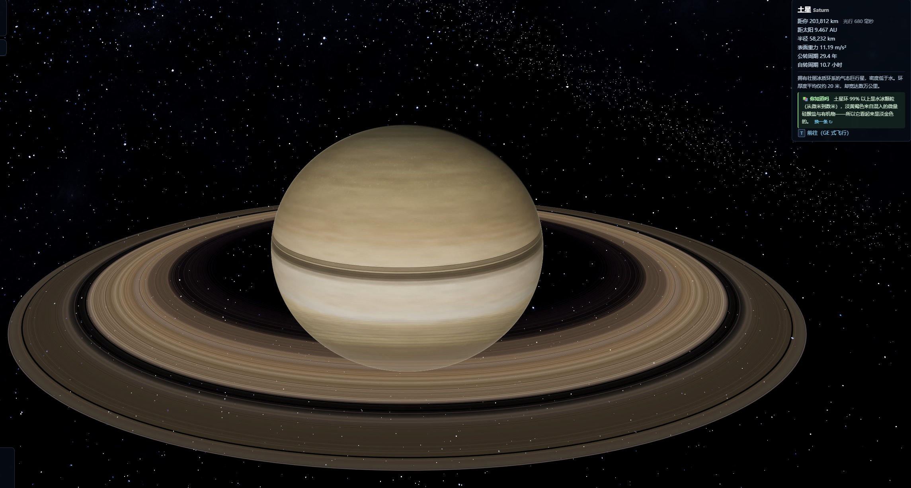
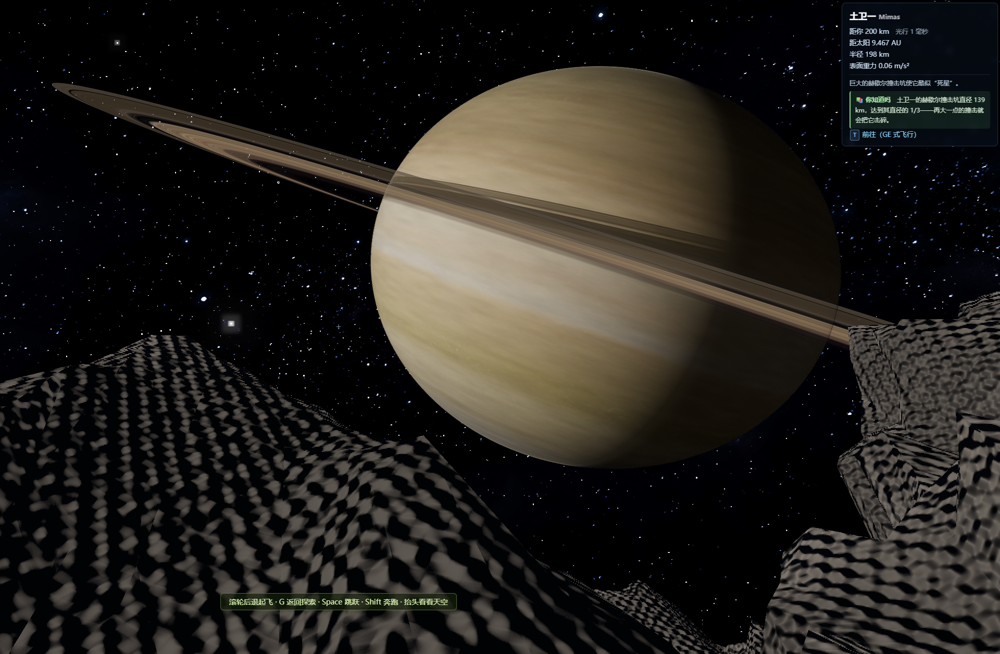
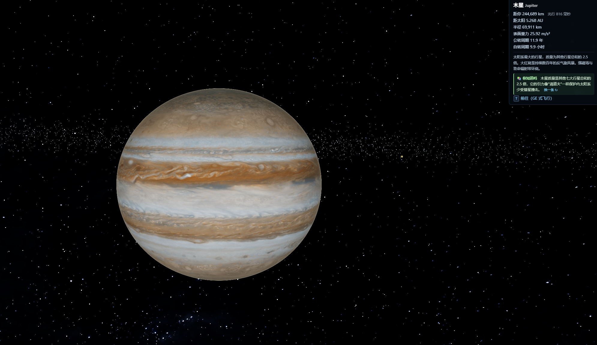
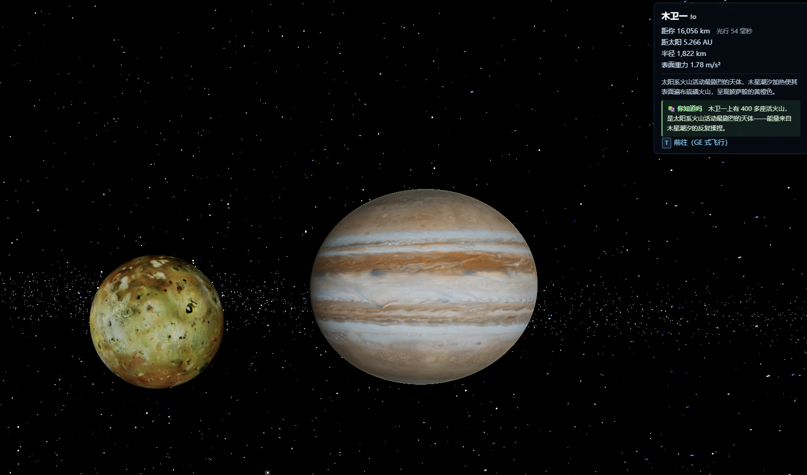
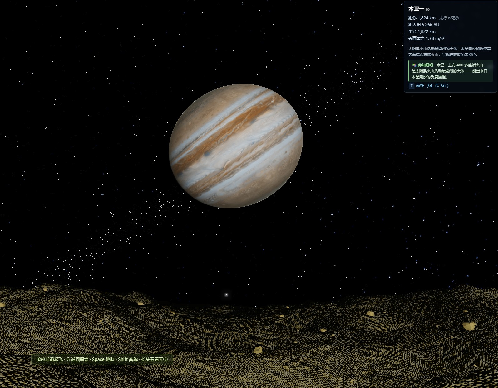
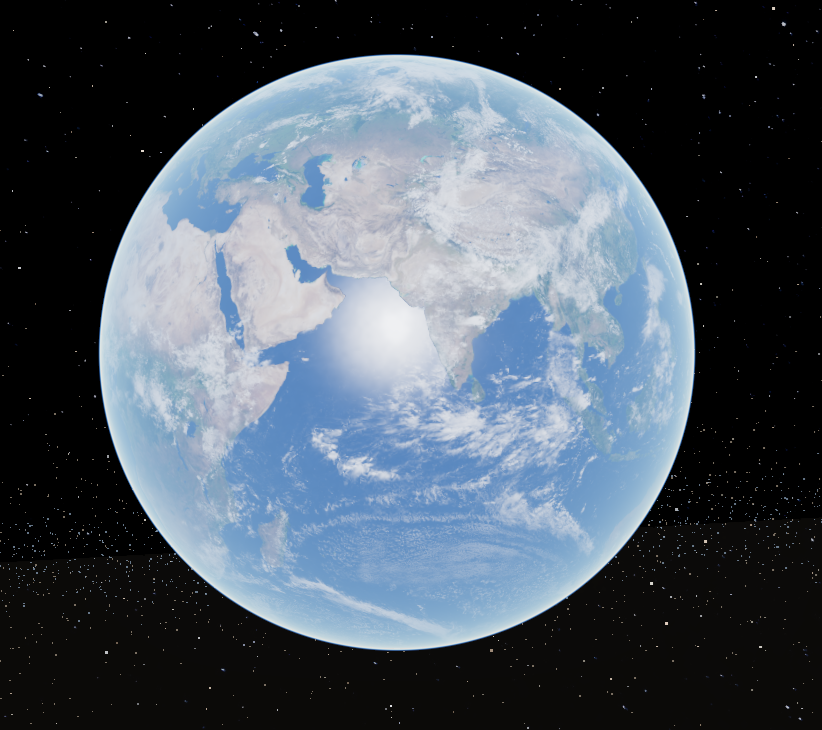
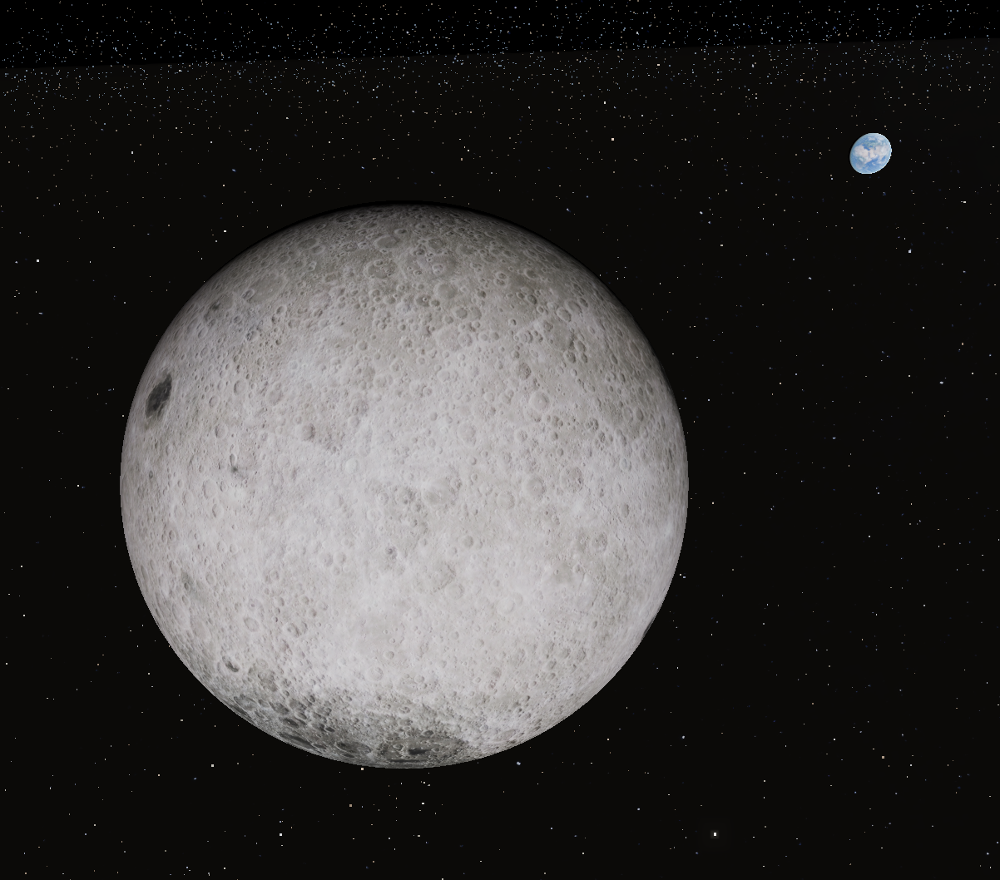
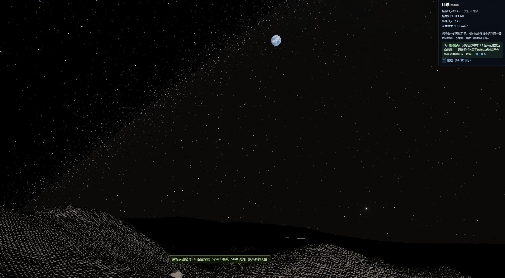
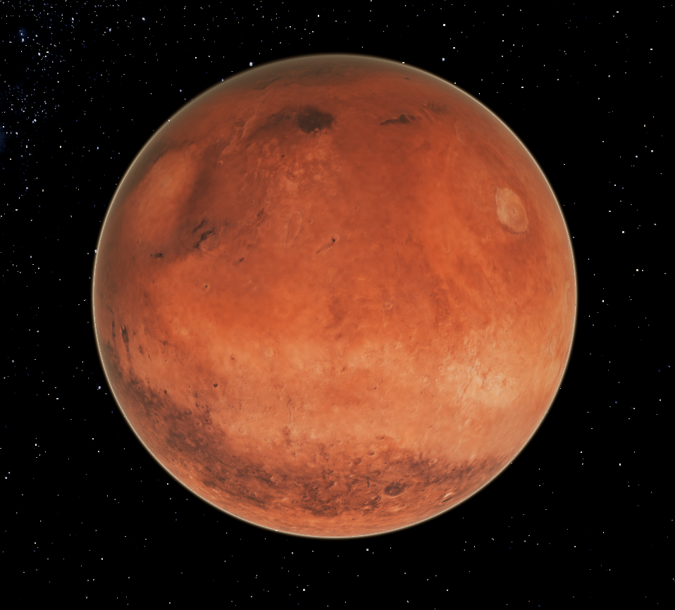

<div align="center">

# 🚀 Solar Wanderer · 遨游太阳系

**A 1:1 real-time solar system explorer — entirely in your browser. Now on your phone.**

Powered by NASA JPL ephemerides. The planets are where they are **right now**.

[](https://sw.icodestar.net)
[](LICENSE)
[](https://threejs.org)
[](https://github.com/hyqzz/Solar-Wanderer/stargazers)

*Zero install · Zero account · Zero backend · Desktop **&** mobile · ~200 kB gzipped*

<br>

### ▶ Demo video

<a href="https://youtu.be/3rwShi6oF0o" title="Play Solar Wanderer demo on YouTube">
  
</a>

<br>

[](https://youtu.be/3rwShi6oF0o)

<sub>Opens the demo recording on YouTube in your browser · Prefer to explore yourself? [**Launch the live app →**](https://sw.icodestar.net)</sub>

</div>

---

> ### 🆕 v2.0.0 — Full mobile support
> The entire 1:1 real-time solar system now runs on your phone. **Pinch** to zoom from Earth orbit straight down to standing on the Moon, **drag** to orbit, **tap** any body to fly there. On-screen joystick for walking and flying, a persistent simulation clock, and GPU auto-tiering tuned for phones. Pull out your phone and try it — [sw.icodestar.net](https://sw.icodestar.net).

---

<table>
<tr>
<td></td>
<td></td>
</tr>
<tr>
<td></td>
<td></td>
</tr>
<tr>
<td></td>
<td></td>
</tr>
<tr>
<td></td>
<td></td>
</tr>
<tr>
<td></td>
<td></td>
</tr>
</table>

> *Left to right, top to bottom: standing on the Moon watching Earthrise · Saturn's rings · entering Jupiter's cloud deck · diving underwater on Earth · Pluto's heart-shaped plain · the outer solar system*

---

## Why Solar Wanderer?

Most space simulators make you choose between scientific accuracy and immersion. Solar Wanderer does both — on any device.

| | Solar Wanderer |
|---|---|
| **Scale** | True 1:1 km — every planet, every moon, every AU, from 0.5 m to 100,000 AU |
| **Accuracy** | NASA JPL Horizons verified · ≤0.074° for planets · 21 moons fitted from state vectors |
| **Immersion** | Seamless descent from orbit → atmosphere → surface → walking → underwater (no cuts, no loading) |
| **Scope** | Sun to the Oort Cloud (100,000 AU) · asteroid belt · Kuiper belt · 4 real comets · past the heliopause where Voyager 1 & 2 are now |
| **Anywhere** | Desktop keyboard/mouse **and** full mobile touch — same physics, same scale |
| **Size** | ~200 kB gzipped JS · no server · no GPU farm |

---

## Features

- 🕐 **Real time** — launch it and see the solar system *right now*. Press `N` (or tap the clock) to return to the present after time-traveling.
- 📏 **True 1:1 scale** — floating-origin + logarithmic depth renders 0.5 m to 100,000 AU without a seam or a pop.
- 📱 **Full mobile support** — pinch-to-zoom, one-finger orbit, two-finger pan, tap-to-fly, on-screen joystick for walk/fly, persistent clock, directory bottom sheet. GPU auto-tiering for phones.
- 🌍 **Google Earth controls** extended to the whole heliosphere — drag, scroll, double-click-to-fly, keyboard pan, inertia, pole-flip.
- 🚶 **Land and walk** on 19 solid worlds with real surface gravity. Jump 6× higher on the Moon. Dive underwater on Earth.
- 🌅 **Ray-marched atmospheres** — Rayleigh+Mie scattering: blue limb from space, red sunsets, butterscotch Martian sky. Dive into Jupiter's cloud deck.
- 🪐 **Saturn's rings** — NASA gold-brown tint, ice-particle grazing scatter, shadow cast onto the planet body.
- 🚀 **6DOF free flight** 1 m/s → 2 AU/s, time warp ×10 years/s, instant freeze anywhere.
- ☄️ **Full heliosphere** — asteroid belt, Kuiper belt, 28 real TNOs, zodiacal light, termination shock, heliopause, Oort Cloud.
- 🔭 **21 real bright stars** (Hipparcos catalog, Chinese/Western names, light-years displayed) with real 3D parallax.
- 🌐 **Bilingual** — Chinese / English UI, auto-detected from your browser language.
- 🔬 **Verifiable** — `npm run verify` cross-checks live against the JPL Horizons API.

---

## Quick Start

```bash
git clone https://github.com/hyqzz/Solar-Wanderer.git
cd Solar-Wanderer
npm install
npm run dev      # → http://localhost:5173
```

Or just open **[sw.icodestar.net](https://sw.icodestar.net)** on any device — nothing to install.

---

## Controls

> Press **H** in-game (or tap **❓**) for the full control reference.

### 🖱 Desktop

| Action | Control |
|--------|---------|
| Rotate around focus | Left-drag |
| Zoom (screen-center) | Scroll wheel / PageUp PageDown |
| Pan space | Right-drag |
| **Fly to a body** | Double-click its label, or pick it in the 🪐 directory |
| **Click a body** | Lock focus — then scroll zooms straight toward it |
| Scroll all the way in | **Seamless landing** → surface walking |
| Scroll out while walking | **Seamless takeoff** back to orbit |
| Dive underwater | Scroll in at water surface |
| Surface walk | Mouse look + WASD, Space to jump |
| Free flight | `F` — 6DOF, `X` to freeze, `Esc` back |
| Time warp | `[` / `]` slower/faster · `P` pause · `N` back to now |
| Inertial view | `V` — watch moons orbit while time-warping |

### 📱 Mobile

| Action | Gesture |
|--------|---------|
| Rotate around focus | One-finger drag |
| Zoom | Pinch in / out |
| Pan space | Two-finger drag |
| **Fly to a body** | Tap its label, or pick it in the directory sheet (☰) |
| Land / take off | Pinch all the way in to land · use the on-screen **Takeoff** button to leave |
| Walk / fly | On-screen joystick + look-drag |
| Time & display | Tap the clock (top-right) to expand time warp + toggles |
| Directory | Tap **☰** (bottom-right) for the full body catalog |

**Try this:** open the directory → tap *Moon* → pinch all the way in → you land on the surface → look up: the blue Earth hangs in the Moon's black sky.

---

## Accuracy

| Body | vs NASA JPL Horizons |
|------|----------------------|
| Planets (9) | 0.0007° – 0.074° |
| Moon | 0.12° (truncated ELP) |
| Moons (21) | 0° at epoch · ≤ 0.22° after 10 days |
| Earth rotation | Sub-second meridian · 23.4° summer solstice · 1 sidereal day |

```bash
npm test          # 33 unit/accuracy tests (offline JPL fixtures)
npm run verify    # live cross-check against NASA JPL Horizons API
npm run fit-moons # refit moon orbits to today's epoch
npm run build     # → dist/ (684 kB JS, ~200 kB gzip) — pure static deploy
```

---

## Architecture

```
src/
├── astro/          # Pure-function ephemeris (Node-testable, no deps)
│   ├── planets.js  # JPL Standish elements → heliocentric ecliptic J2000
│   ├── moon.js     # Truncated ELP lunar theory
│   ├── moons.js    # Horizons-fitted satellite elements
│   └── bodies.js   # IAU/WGCCRE rotation models
├── engine/
│   ├── orbitCamera.js  # Google Earth–style camera (GE controls + pole-flip)
│   ├── ship.js         # 6DOF flight + surface walking + buoyancy
│   ├── world.js        # Floating-origin scene graph
│   └── quality.js      # GPU auto-tiering (discrete GPU detect, FPS guard)
├── scene/          # Renderers: sun shader, atmospheres, rings, terrain, starfield…
└── ui/             # HUD, labels, directory, edu-facts, i18n, touch controls
```

Three.js 0.165 · Vite 5 · native ESM · WebGL2 · logarithmic depth buffer.

---

## Roadmap

- [ ] USGS real DEM terrain (LOLA for Moon, MOLA for Mars)
- [ ] Solar/lunar eclipse shadow volumes
- [ ] Ambient sound (radio hiss in space, surface crunch, underwater)
- [ ] Save/restore bookmarks (position + time)
- [ ] VSOP87 + ELP2000 for ±3000 year validity

✅ **Done in v2.0.0:** full mobile touch support.

---

## Contributing

Issues and PRs are very welcome — see [CONTRIBUTING.md](CONTRIBUTING.md).

Ideas especially wanted: translations, real terrain DEMs, eclipse shadows, ambient sound.

**⭐ Star the repo** if it made you feel small in a good way.

---

## Credits

| | |
|---|---|
| **Ephemerides** | NASA JPL (*Standish 1992* planetary elements · Horizons API state vectors) |
| **Textures** | [Solar System Scope](https://www.solarsystemscope.com/textures/) CC-BY-4.0 · Steve Albers SOS · NASA JPL Photojournal (public domain) |
| **Rotation models** | IAU/WGCCRE reports |
| **Bright stars** | Hipparcos catalog |

---

<div align="center">

MIT © 2026 [hyqzz](https://github.com/hyqzz)

*Built with Three.js · Verified against NASA JPL · Made to feel small*

</div>
