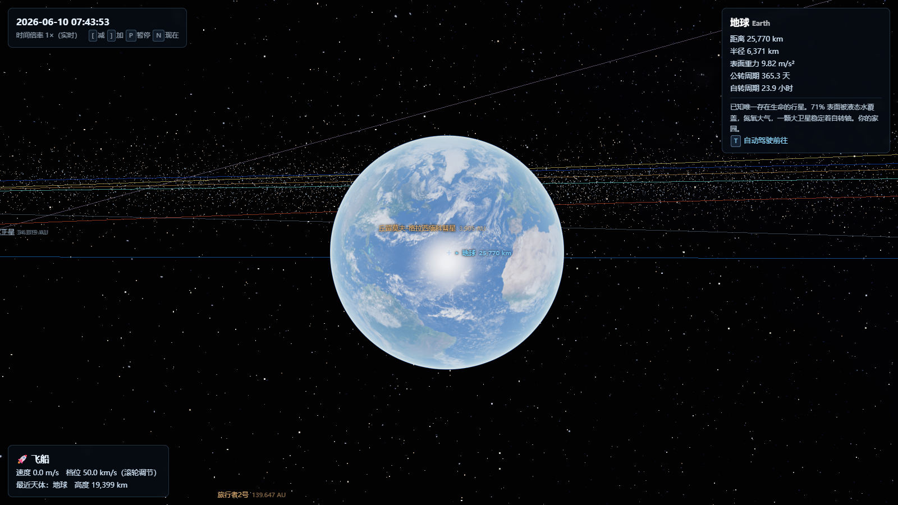

# Solar Wanderer · 遨游太阳系

**A 1:1 real-time solar system you can freely explore in your browser.**
Powered by real NASA JPL ephemerides — the planets are exactly where they are *right now*.

**太阳系 1:1 实时自由探索** — 基于系统时间和 NASA JPL 星历精确还原**此刻**的太阳系：从太阳表面到 120 AU 的日球层顶，自由飞行、登陆行走、身临其境。

**[▶ Live Demo 在线体验](https://hyqzz.github.io/Solar-Wanderer/)** · [English](#why-solar-wanderer) · [中文](#特性) · MIT License · Zero install — just a browser



## Why Solar Wanderer?

- 🕐 **Real time, real sky** — launch it and you see the solar system as it is at this very moment. Planet positions verified against NASA JPL Horizons to ≤0.074°; 21 major moons fitted from Horizons state vectors.
- 📏 **True 1:1 scale** — every distance and radius is in real kilometers. Floating origin + logarithmic depth render seamlessly from 0.5 m to 120 AU.
- 🌍 **Google Earth–style controls, extended to the whole heliosphere** — drag, scroll, and seamlessly descend from orbit all the way to walking on the surface (No Man's Sky–style landing, no loading screens, no cuts).
- 🚶 **Land and walk on 19 solid worlds** with true surface gravity — jump 6× higher on the Moon.
- 🌅 **Physically-based atmospheres** — ray-marched Rayleigh+Mie scattering: blue limb from space, red sunsets on the ground, butterscotch Martian sky, even diving into Jupiter's cloud decks.
- 🚀 **6DOF free flight** from 1 m/s to 2 AU/s, plus a time machine: pause, rewind, 10 years per second, one key back to *now*.
- ☄️ **The whole heliosphere**: asteroid belt, Kuiper belt, 4 real comets with anti-sunward tails, zodiacal light, termination shock, heliopause, Voyager 1 & 2.
- 🔬 **Verifiable accuracy**: `npm run verify` cross-checks live against the NASA JPL Horizons API; 33 offline precision tests included.

No install, no account, no GPU farm — pure Three.js + WebGL2, ~170 kB gzipped JS.

## 特性

- 🕐 **真实星历**：启动即为系统当前时刻，行星位置与 NASA JPL Horizons 对照误差 ≤0.074°；21 颗主要卫星轨道由 Horizons 实测状态向量拟合
- 📏 **真 1:1 比例**：所有距离半径均为真实千米值，浮动原点 + 对数深度缓冲实现从 0.5 米到 120 AU 的无缝渲染
- 🌍 **Google Earth 式操控扩展到全日球层**：滚轮一路拉近 → 无缝降落地表行走（无人深空式无缝衔接，无加载无切换）
- 🛰 **NASA 实测贴图**：8K 地球昼/夜/云、8K 月球/火星/木星、新视野号冥王星等（CC-BY-4.0 / 公有领域）
- 🌅 **物理大气散射**：光线步进 Rayleigh+Mie——太空看蓝色弧光，地表看蓝天与晨昏红霞，火星橙天，可下潜木星云甲板
- 🚶 **行星登陆**：19 颗固体天体可登陆行走，真实表面重力（月球上跳跃比地球高 6 倍）
- 🚀 **自由飞行**：6DOF 飞船，1 m/s 到 2 AU/s，任意位置悬停；**时间机器**：暂停/倒退/10 年每秒/一键回到现在
- ☄️ **日球层全内容**：小行星主带、柯伊伯带、4 颗真实彗星、黄道尘光、终止激波、日球层顶、旅行者 1/2 号
- 🇨🇳 **全中文界面** + 60 余条天体科教知识卡片

## Quick Start 快速开始

```bash
git clone https://github.com/hyqzz/Solar-Wanderer.git
cd Solar-Wanderer
npm install
npm run dev      # → http://localhost:5173
```

**Google Earth 式操作**——进入后即环绕地球，按 **H** 查看完整操作说明。

| 操作 Controls | 功能 |
|------|------|
| 左键拖拽 / 滚轮 Drag / Wheel | 环绕焦点旋转（带惯性）/ 以屏幕中心拉近拉远 |
| 滚轮拉近到底 Scroll all the way in | **无缝降落地表，自动转入行走**；行走中滚轮后退 = 无缝起飞 |
| W S A D / 方向键 | 平移视角（随高度调速） |
| Shift+A/D · Shift+W/S · Ctrl+拖拽 | 旋转航向 · 倾斜看地平 · 3D 环视 |
| 右键拖拽 / R | 平移整个空间 / 复位视角 |
| 顶部搜索框 / 🪐 目录 | 输入"月球 / mars / 哈雷 / 旅行者"→ 飞行动画前往 |
| 双击标签 / T / 数字键 1-9,0 | 动态前往，到达后目标居中 |
| G | 贴近地表时登陆行走（真实重力）/ 返回探索 |
| F | 6DOF 自由飞行（X 急停悬停，Esc 返回） |
| [ ] / P / N | 时间倍率（可倒退）/ 暂停 / 回到现在 |
| O / L / H | 轨道线 / 标签 / 帮助 |

> Try this 试试：搜索"月球"→ 滚轮一路拉近 → 自动落在月面 → 抬头，蓝色的地球正悬在月球的黑色天空中。
> Search "moon" → scroll all the way in → you land on the surface → look up: the blue Earth hangs in the Moon's black sky.

## Accuracy 精度验证

| Body 天体 | vs NASA JPL Horizons |
|------|------|
| Planets 行星（9） | 0.0007°–0.074° |
| Moon 月球 | 0.12°（truncated ELP） |
| Moons 卫星（21） | epoch 0°, +10 days ≤0.22° |

```bash
npm test               # 33 项单元/精度测试（含 JPL 离线基准）
npm run verify         # 与 NASA JPL Horizons 实时对照（需联网）
npm run fit-moons      # 重新拟合卫星轨道（刷新历元到现在）
npm run build          # 生产构建 → dist/ 纯静态部署
```

## Tech 技术

Three.js + Vite, pure ESM, no TypeScript, no backend. The ephemeris layer is dependency-free pure functions (JPL Standish planetary elements, truncated ELP lunar theory, IAU/WGCCRE rotation models, Horizons-fitted satellite elements) — usable standalone in Node. GPU auto-tiering picks your discrete GPU and degrades gracefully (`?quality=high|lite`). Full SDLC docs in `docs/sdlc/`.

## Contributing 参与贡献

Issues 和 PR 一律欢迎 — translations, real DEM terrain, eclipse shadows, VSOP87 extension, sound design… see the roadmap in `CLAUDE.md`. Star ⭐ the repo if it made you feel small in a good way.

## Data & Credits 数据与素材来源

- Ephemerides 星历: NASA JPL (Standish *Approximate Positions of the Planets*, Horizons API)
- Textures 贴图: [Solar System Scope](https://www.solarsystemscope.com/textures/) (CC-BY-4.0, based on NASA/USGS data), [Steve Albers SOS](https://stevealbers.net/albers/sos/sos.html), NASA JPL Photojournal (public domain)
- Rotation models 自转模型: IAU/WGCCRE reports

## License

[MIT](LICENSE) © 2026 hyqzz
