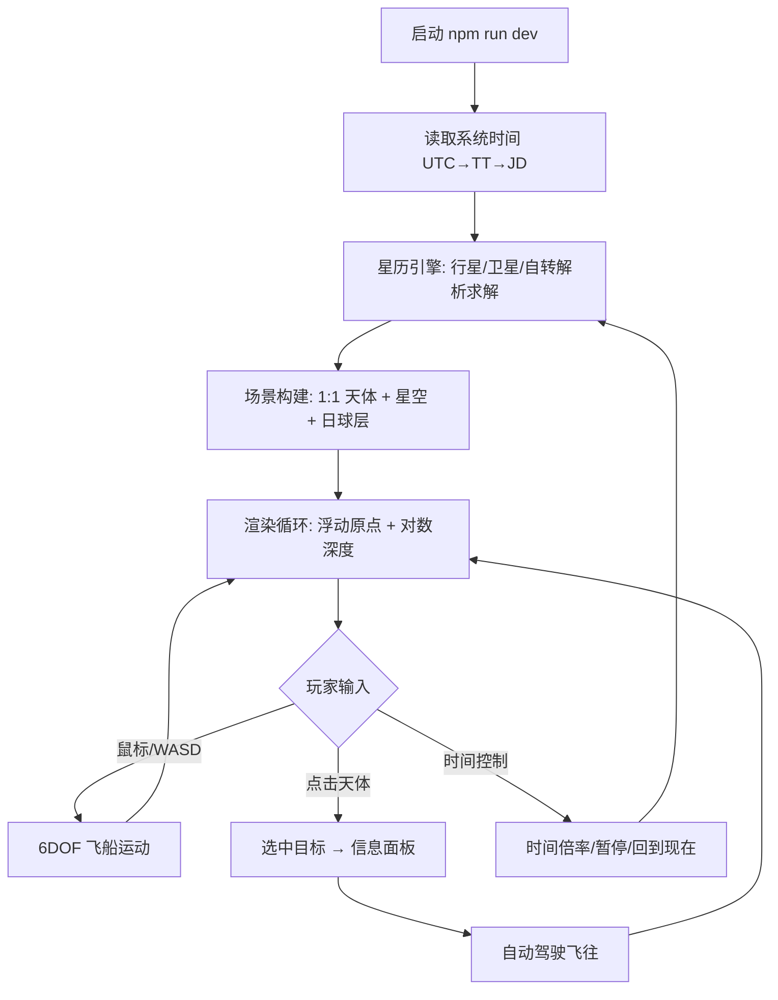
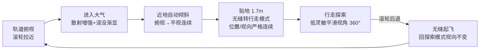

# 需求分析文档 (Phase 1)

> 项目：**Heliosphere — 太阳系 1:1 实时自由探索游戏**
> 日期：2026-06-10 ｜ 场景：新功能开发（从零实现）

## 1. 需求摘要

> 一句话：在浏览器中以 1:1 真实比例、基于系统时间的真实星历，构建一个可自由飞行探索整个日球层（太阳→日球层顶 ~120 AU）的 3A 视觉级太空游戏。

## 2. 详细分析（功能点拆解）

| # | 功能点 | 说明 | 优先级 |
|---|--------|------|--------|
| F1 | 真实星历引擎 | 根据系统时间计算 8 大行星 + 冥王星的精确位置（JPL Keplerian 元素 + 长期摄动项，1800–2050 年有效，角分级精度），并以 JPL Horizons 官方数据验证 | P0 |
| F2 | 1:1 比例渲染 | 所有天体半径、轨道距离均为真实千米值；通过相机相对渲染（浮动原点）+ 对数深度缓冲解决 10^0 ~ 10^10 km 跨度的浮点精度问题 | P0 |
| F3 | 卫星系统 | 月球（截断 ELP2000，~0.2° 精度）、伽利略四卫星、土卫六等主要卫星、火卫、天卫、海卫一（逆行） | P0 |
| F4 | 自转与极轴 | IAU 行星自转模型（极轴指向 + W = W₀ + Ẇ·d），保证此刻每颗行星朝向太阳的面、昼夜晨昏线真实 | P0 |
| F5 | 6DOF 飞船控制 | 无人深空式自由飞行：鼠标俯仰/偏航、滚转、WASD 平移、指数级速度档（1 m/s → 数千倍光速等效巡航）、惯性阻尼 | P0 |
| F6 | 时间系统 | 启动即为系统当前时刻（UTC→TT→儒略日），支持暂停 / 加速 / 倒退 / 回到现在 | P0 |
| F7 | 3A 视觉 | 真实 NASA/CC-BY 行星贴图（在线下载，含法线/云层），失败时程序化贴图兜底；太阳着色器（米粒组织+色球+日冕辉光）、行星大气边缘散射、土星环（真实内外径+投影）、银河系背景 + 真实亮星表 | P0 |
| F8 | 日球层结构 | 终止激波（~90 AU）、日球层顶（~120 AU，鼻向黄经 ~255°的非对称形状）、弓形波前可视化；小行星主带、柯伊伯带统计点云 | P1 |
| F9 | 探索交互 | 天体标签、点击选星、目标信息面板（真实物理参数）、自动驾驶飞往目标、轨道线开关 | P0 |
| F10 | HUD | 中文界面：仿真时间、时间倍率、速度、与目标距离、操作帮助 | P0 |
| F11 | 旅行者号 | Voyager 1/2 当前近似位置标记（日球层探索彩蛋） | P2 |

## 3. 隐含需求

- “根据系统时间精确还原此刻” ⇒ 需要 UTC→TT 转换（ΔT≈69s）与持续推进的仿真时钟，而非启动时一次性快照。
- “身临其境” ⇒ 必须有声音以外的沉浸要素：平滑相机、曝光自适应、星空视差（恒星视为无穷远）、指针锁定（Pointer Lock）。
- “1:1” ⇒ 行星际距离极空旷，必须提供超光速巡航档与自动驾驶，否则不可玩。
- 浏览器交付 ⇒ 一条命令可启动（`npm run dev`），可构建静态产物。

## 4. 业务场景（Who / When / Why）

- **Who**：天文爱好者 / 游戏玩家（中文用户）。
- **When**：想直观看到“此时此刻”太阳系真实格局（行星在哪、月相如何、木卫排布）。
- **Why**：教育 + 探索娱乐，类似 SpaceEngine / 无人深空自由模式。

## 5. 技术约束

- Windows 11，Node v24，npm 可用，网络可用（npm registry ✅、JPL Horizons ✅）。
- 目录为空，非 git 仓库 ⇒ 全新工程。
- 浏览器 WebGL2 + Three.js；纯 ESM JS（不引入 TS 编译复杂度）。
- 星历计算必须为**纯函数模块**（不依赖 DOM/three），以便 `node --test` 单元测试与 Horizons 对照验证。
- 贴图下载源：solarsystemscope.com（CC-BY-4.0）等；必须有程序化兜底，保证离线也能运行。

## 6. 边界情况清单（≥5）

| # | 边界情况 | 处理策略 |
|---|----------|----------|
| B1 | 仿真时间超出星历有效期（<1800 或 >2050 年） | 元素外推仍可计算，HUD 显示精度警告 |
| B2 | 相机极近行星表面（km 级）与极远（10^10 km）共存 | 浮动原点 + logarithmicDepthBuffer，单位取 km |
| B3 | 高倍时间加速下卫星轨道运动离散跳变 | 每帧按真实仿真时刻解析求解（无数值积分，无累积误差） |
| B4 | 超高速飞行穿过天体 | 与最近天体的碰撞半径检测，速度自动随距离缩放（接近减速） |
| B5 | 贴图下载失败 / 完全离线 | onError 回退程序化 Canvas 贴图，游戏不中断 |
| B6 | Kepler 方程高离心率（冥王星 e≈0.25）不收敛 | 牛顿迭代 + 收敛上限 + 二分兜底，单测覆盖 e→0.97 |
| B7 | 标签遮挡/重叠（远处行星像素级大小） | 标签按屏幕投影与距离排序、淡出，天体最小像素光点增强 |
| B8 | 标签页失焦后 requestAnimationFrame 暂停导致 dt 巨大 | dt 钳制（≤0.1s 实时步长），仿真时钟独立于帧率 |
| B9 | 倒退时间为负倍率 | 星历为时间的解析函数，天然支持负向 |

## 7. 影响范围

全新工程，无既有代码。产物：`package.json`、`index.html`、`src/`（astro / engine / scene / ui 四层）、`tools/`（贴图下载、Horizons 验证脚本）、`tests/`、`docs/sdlc/`。

## 8. 业务流程图

## 9. 风险识别

| 风险 | 等级 | 缓解 |
|------|------|------|
| 星历公式系数抄错导致位置错误 | 高 | **用 JPL Horizons API 自动对照验证**（tools/verify-ephemeris），误差阈值化为测试 |
| 浮点精度导致近表面抖动 | 高 | 相机相对渲染（每帧 CPU 端 double 减法），GPU 只见小数值 |
| 1:1 比例下可玩性差 | 中 | 指数速度档 + 自动驾驶 + 标签导航 |
| 贴图源失效 | 低 | 程序化兜底 + 多源重试 |
| 性能（卫星+点云+着色器） | 中 | 点云用 BufferGeometry 单次绘制；按距离 LOD 隐藏卫星 |

## 9.5 需求增补（用户第二轮要求 · 2026-06-10）

| # | 增补需求 | 实现策略 | 优先级 |
|---|----------|----------|--------|
| F12 | **真实 NASA 影像贴图** | 从 NASA/USGS 衍生源（solarsystemscope CC-BY-4.0，基于 NASA/USGS 实测数据）下载全部行星 2K/4K 等距圆柱投影贴图：地球昼/夜/云/法线/高光、各行星表面、土星环、银河全景；主要卫星尝试 USGS 实测图，失败时程序化兜底 | P0 |
| F13 | **物理正确光照** | 太阳点光源平方反比衰减、HDR 渲染 + ACES 色调映射 + 自适应曝光、真实太阳角直径、行星夜面城市灯光 | P0 |
| F14 | **物理大气散射** | 逐行星单次散射光线步进着色器（Rayleigh + Mie，真实标高与散射系数缩放）：太空看蓝色弧光边缘、地表看蓝天/红色晨昏、火星橙天、金星浓雾、土卫六霾层；相机在大气内外均正确 | P0 |
| F15 | **行星登陆与地表行走** | 固体天体支持登陆：近地表自动生成程序化地形细节（与真实反照率贴图颜色融合，月球撞击坑/火星峡谷风格化噪声），行走模式以真实表面重力 g=GM/r² 计算步行/跳跃，碰撞贴地；气态巨行星不可降落（云顶警告） | P0 |
| F16 | **真实物理规律** | 真实重力加速度、真实天体半径/质量/自转、真实轨道力学（解析星历）、真实日地距离光强比例 | P0 |

| F17 | **日球层内容完整**（用户第三轮要求） | 小行星主带 + 希尔达群、柯伊伯带、著名彗星（哈雷、海尔-波普等真实轨道根数 + 反日彗尾随日距变化）、黄道尘光、终止激波/日球层顶/日鞘结构、旅行者 1/2 号 | P0 |
| F18 | **任意位置悬停驻留**（用户第三轮要求） | 惯性阻尼默认开启，松开按键即减速悬停；X 键立即停泊；停泊后天体按真实星历继续运转，玩家可静观行星运行 | P0 |

| F19 | **Google Earth 交互范式**（用户第四轮要求） | 默认"探索模式"：相机锚定焦点天体体固系（经纬+距离），左键拖拽旋转（带惯性）、滚轮指数缩放、北极朝上、焦点恒居屏幕中央；扩展到日球层任意天体 | P0 |
| F20 | **GE 式动态前往**（用户第四轮要求） | T/搜索/双击触发签名式飞行动画：对数高度剖面 + 正弦弧线拉升 + 视线提前锁定目标，到达时目标居中、停于日照面上空 3.5 倍半径；时长随距离对数缩放（2–7s，快速动态） | P0 |
| F21 | **地点搜索与天体目录**（用户第四轮要求） | GE 式顶部搜索框（中/英文自动补全）+ 分类天体目录侧栏（恒星/行星/卫星按母星分组/矮行星/彗星/探测器/日球层边界），点击即前往；信息面板增加实时距离、光行时间等求知向数据 | P0 |
| F22 | **月面见地球**（用户第四轮要求） | 月球近侧（潮汐锁定朝地面）行走时抬头可见带相位的地球悬于黑色天空——由真实星历+潮汐锁定姿态+行星材质自然涌现，测试截图实证 | P0 |

> “身临其境”判据：从地球地表看——白天蓝天渐变、日落红霞、夜晚星空银河与城市灯光；从月面看——黑天白日、地球悬空；从土星环平面穿越——颗粒带尺度感。

## 10. 验收标准

1. 启动后显示的行星位置与 JPL Horizons 同时刻数据误差：日心黄经 < 0.1°（行星）、月球 < 0.5°。
2. 可从地球表面附近连续飞至日球层顶并返回，无精度抖动、无穿模崩溃。
3. 时间加速 10^6 倍下轨道运动平滑正确；“回到现在”恢复系统时间。
4. 完全断网时仍可启动并游玩（程序化贴图）。
5. `node --test` 全部通过。

---

# R7 需求/问题分析（用户第七轮要求 · 2026-06-11）

## R7.1 需求摘要

一句话：把"接近→进入大气→落地→行走→起飞"做成无人深空级无缝连续体验，把全部天体（尤其火星轨道以外）的视觉做到 SpaceEngine 级，并配套一整套适配三维空间的镜头操控（指针中心缩放、方向一致、全视角 360° 无快速旋转）与 GPU 自适应画质（多卡选独显，无独显降档）。

## R7.2 逐项分析（缺陷定根因 / 功能定策略）

| # | 类型 | 现象 | 根因定位（文件:行为） | 对策 |
|---|------|------|----------------------|------|
| 1 | 缺陷 | 滚轮拉近准备登陆时衔接生硬、出戏 | ① `orbitCamera.js minDist()` = `R×1.004+1` —— 地球停在地表上方 **25.5 km**，滚轮到底后按 G 直接瞬移到地面（视角、位置双跳变）；② `enterWalk()` 强制 `pitch=0`（视线跳变）；③ 无 GE 式近地自动倾斜，始终垂直俯视直到瞬移；④ 地形激活后 6 级 LOD 一帧全量重建（卡顿跳帧） | 地形感知最小距离（滚轮可一路落到真实地面+1.7m）；高度驱动自动倾斜（俯视→平视连续过渡）；到地面无缝自动转行走（位置/视向严格连续）；行走中滚轮后退=无缝起飞回探索；LOD 重建分帧 |
| 2 | 缺陷 | 行走模式鼠标左右方向与探索相反 | `ship.js updateWalk: w.yaw -= input.dx * MOUSE_SENS` —— 鼠标右移视线左转，与探索模式拖拽后的视觉方向相反 | 反号为 `+=`（鼠标右移=向右看，FPS/探索一致） |
| 3 | 缺陷 | 行走抬头看星空出现快速旋转 | ① 浏览器指针锁定 `movementX/Y` 已知尖峰 bug（Chrome 锁定瞬间可达数百 px）无钳制（`ship.js Input.mousemove`）；② 行走灵敏度与飞行同为 0.0022 rad/px 偏高；③ 无平滑，俯仰接近天顶时偏航表现为整屏滚转，瞬时大输入即"快速旋转" | 每事件位移钳制；行走灵敏度降至 0.0011 + 指数平滑（时间常数 ~50ms）；保持俯仰 360° 连续无钳制（含过顶翻越） |
| 6 | 缺陷 | 滚轮缩放不以指针为中心 | `orbitCamera.js:203` 滚轮只改 `distTarget`，与光标位置无关 | 光标射线与焦点天体求交得体固系定点，缩放时按收敛比例把 lat/lon 向定点收敛（GE zoom-to-cursor）；PageUp/Down 保持屏幕中心缩放（现行为即是） |
| 4 | 功能 | 火星以外天体不够逼真 | 贴图资产证据：uranus 0.07MB、neptune 0.23MB、pluto 0.26MB、saturn 1.05MB vs mercury 14MB/mars 8MB；且气巨贴图静态、近看糊；外行星卫星多数无实测贴图（程序化 1024×512 兜底） | ① 行星材质片元级程序化细节（气巨：纬向拉伸湍流双尺度 + 风暴涡 + 临边昏暗；岩质：各向同性细节），分辨率无关、距离淡入（SpaceEngine 路线）；② 程序化兜底贴图升 2048×1024 + 质量增强；③ 尝试拉取更高清外行星贴图（saturn 8k / pluto 8k） |
| 5 | 功能 | 缺少进入大气层的逼真过渡（含气巨） | 气巨 `minDist` 停在云顶上 280km（木星），大气散射常数为外观调参，进入后几乎无视觉变化；岩质行星入气仅靠 fog（只作用于地形材质） | 气巨/冰巨允许下潜至云甲板上空；大气着色器加相机深度驱动的密度增幅（外观不变，入气后雾化增强）；全屏大气浸没层（色调取自该行星散射系数，深度越深越浓直至云中白化）；曝光联动 |
| 7 | 功能 | 镜头操控需整套适配 3D | 现有 GE 平面地图范式直接搬到 3D：拖拽灵敏度不随高度收敛（近地一拖即飞）、缩放无指针锚定、无近地姿态过渡、行走/飞行/探索切换视向不连续 | 整套方案：指针中心缩放 + 高度比例拖拽灵敏度（拖拽≈抓住地面）+ 近地自动倾斜 + 模式切换视向连续（探索⇄行走⇄飞行均保位姿）+ Ctrl/Shift 拖拽旋转航向倾斜 + 既有极点穿越翻转，全维度 360° 循环 |
| 8 | 功能 | 多卡选独显 / 无独显降档 | `WebGLRenderer` 未指定 `powerPreference`（浏览器默认可能选核显）；全部画质参数硬编码单档 | `powerPreference:'high-performance'`（双显卡系统强制独显）；`WEBGL_debug_renderer_info` 识别 SwiftShader/核显 → 降档（像素比/泛光/大气步进数/地形网格/各向异性/细节着色器） |

## R7.3 业务场景

- **Who**：天文爱好者/学生，参照物为 Google Earth、SpaceEngine、无人深空（NMS）。
- **When**：滚轮从轨道一路放大到地表行走是核心高频动线（GE 用户肌肉记忆）。
- **Why**：身临其境逼真模拟是产品生命线（用户原话），登陆衔接与外行星质量是当前最大出戏点。

## R7.4 技术约束

- Three.js 0.165 + 纯 ESM，无 TypeScript、无构建期着色器系统；坐标约定（黄道→世界映射、浮动原点）不可破坏。
- 行走碰撞与地形几何同源（heightFn），最小距离计算必须用同一函数，否则穿模/悬空。
- requestPointerLock 需用户手势：滚轮属于瞬态激活，但部分浏览器可能拒绝 —— 自动转行走后若锁定失败需提示点击。
- 大气着色器同一份代码服务内/外视角，外观回归风险高 —— 入气增强必须在相机在大气外时严格等于现状。
- 离线可玩约束：高清贴图拉取失败必须无害（程序化兜底已有）。

## R7.5 边界情况清单（≥5）

1. **微小天体登陆**（火卫二 R=6.2km）：自动倾斜起始高度、拖拽灵敏度、minDist 公式必须按半径缩放，不能用绝对千米阈值一刀切。
2. **指针在天体外滚动缩放**：光标射线与球无交点 → 退化为屏幕中心缩放（不得 NaN/跳变）。
3. **极点附近缩放/行走**：体固系经纬奇点 —— 既有 chart-flip 必须与指针中心缩放、自动倾斜共存（lon 收敛要走最短角差）。
4. **海面登陆**（地球海洋）：地面高度=海平面 R+0.001，自动转行走应站在海面，不得反复抖动切换。
5. **气巨下潜到 minDist**：浸没层全浓后继续滚轮不得穿入网格内部；后退滚轮必须能原路退出（无滞回卡死）。
6. **飞行动画(flyTo)进行中**：滚轮/自动转行走/浸没层均不得干扰动画；到达后才恢复整套近地逻辑。
7. **时间加速下行走**：行走用真实 dt，自转 co-rotate 由体固系保证 —— 自动转行走不得引入世界系速度残留。
8. **无 WEBGL_debug_renderer_info 扩展**（隐私浏览器）：GPU 识别失败 → 默认高画质 + 运行时帧率自检降档兜底。
9. **指针锁定尖峰**：锁定建立后第一个 mousemove 事件可达数百 px，钳制阈值要放过正常快速甩动（≤150px/事件）。
10. **触控板用户**：wheel deltaY 连续小值 —— 现有 sign() 累计行为保留，指针中心缩放对小步长同样收敛。

## R7.6 影响范围

| 文件 | 涉及需求 | 改动类型 |
|------|----------|----------|
| `src/engine/orbitCamera.js` | 1/6/7 | 修改（地形感知 minDist、指针缩放、自动倾斜、姿态连续接管） |
| `src/engine/ship.js` | 2/3/1/7 | 修改（yaw 反号、灵敏度+平滑+尖峰钳制、enterWalk 保 pitch、Input 增加光标/修饰键通道） |
| `src/main.js` | 1/5/6/7/8 | 修改（自动登陆/起飞状态机、浸没层驱动、质量档接线、orbitEnv 增地面高度） |
| `src/scene/planetMaterial.js` | 4 | 修改（片元程序化细节：气巨湍流/风暴/临边昏暗，岩质细节） |
| `src/scene/atmosphere.js` | 5/8 | 修改（相机深度密度增幅 uniform、步进数按质量档） |
| `src/scene/terrain.js` | 1/8 | 修改（LOD 分帧重建、GRID 按质量档） |
| `src/scene/builder.js` | 4/8 | 修改（材质参数传递、各向异性/球段数按质量档） |
| `src/scene/proceduralTextures.js` | 4 | 修改（兜底贴图 2048×1024+质量增强） |
| `src/engine/quality.js` | 8 | **新增**（GPU 检测与画质分档） |
| `src/ui/hud.js`/`index.html`/`style.css` | 5/8 | 修改（浸没层 DOM、提示文案） |
| **不碰**：`src/astro/**`（星历层零改动，33 项测试基线不变）、`floating.js`、`rings.js`、`sun.js`、`starfield.js`、`comets.js`、`belts.js`、`heliosphere.js` | | |

## R7.7 业务流程（目标动线）

## R7.8 风险识别

| 风险 | 等级 | 缓解 |
|------|------|------|
| 大气着色器改动破坏既有外观（R5 已 NASA 审查通过） | 高 | 增幅因子在大气外恒等于 1，数学上保证外观不变；审查截图对比 |
| 自动转行走令用户意外（不期望的模式切换） | 中 | 仅在滚轮持续拉近到贴地才触发 + HUD 提示 + 滚轮后退即回 |
| 指针中心缩放与极点翻转互相干扰 | 中 | 收敛量走最短角差；翻转后丢弃该帧光标锚点 |
| powerPreference 改变现有用户 GPU 选择 | 低 | 该值本就是推荐设置；低端识别失败默认高档+帧率兜底 |
| 程序化细节着色器增加片元开销 | 中 | 距离淡入（远处零开销分支）+ 低档关闭 |

## R7.9 最小复现条件（缺陷项）

- #1：代码级 —— `minDist(earth) = 6371×1.004+1 = 6396.49 km`，即悬停下限为地表上方 25.49 km；`enterWalk` 第 208 行 `w.pitch = 0` 直接丢弃当前视向俯仰。
- #2：代码级 —— `w.yaw -= input.dx`，dx>0（鼠标右移）→ yaw 减小 → 视线向西（左）转。
- #3：代码级 —— `Input.mousemove` 对 `movementX/Y` 无任何钳制与平滑，`MOUSE_SENS=0.0022` 全局共用。
- #6：代码级 —— 滚轮处理仅 `distTarget *= pow(1.25, wheel)`，不读取光标位置。

复现脚本：`tools/repro-r7.mjs`（Node 直接驱动 OrbitCamera/Ship，断言以上事实，修复后同脚本反向断言）。

---

# R8 问题分析（用户第八轮反馈 · 2026-06-11）

## R8.1 摘要

①气巨呈现两个边界、最外层有明显圆圈线（破坏逼真）；②探索模式缩放必须以屏幕中心接近/远离——右键把太阳拨到屏幕中心后滚轮接近出现跳跃、不朝中心。

## R8.2 根因

| # | 现象 | 根因（代码证据） |
|---|------|------------------|
| 1a | 最外层圆圈线 | `atmosphere.js` 抖动项 `+ dith`（0–1/255）无条件叠加在大气壳整个投影盘上（预乘 alpha 直加），R7 暗适应提亮+外太阳系曝光（~6.8×）放大后显形为一块以 Ra 为边界硬切的亮盘 |
| 1b | 行星双边界 | 着色器射线求交按**正球** Rg/Ra 计算，而气巨网格按扁率压扁（土星 y×0.902，极区低 5700km）——"地面辉光/遮挡"画在球面 Rg 处，与压扁的真实视边缘错开成第二条边界 |
| 2a | 缩放不朝屏幕中心/跳跃 | `orbitCamera` 缩放=收缩 dist（向"焦点+panOffset 锚点"收敛）。倾斜（tilt≠0，R7 起飞接管后常见）或平移后**视线不再指向锚点** → 缩放朝锚点运动、屏幕中心目标甩偏（复现：倾斜 119°、平移 180° 甩到身后） |
| 2b | 离散跳跃 | `Input.wheel += sign(deltaY)` 按事件个数整格累计——高速滚轮/触控板每帧可累计 ±10+ 格 → 单帧 9.3× 缩放跳变 |
| 2c | 需求修订 | 用户明确：滚轮与 PageUp/Down **均以屏幕中心**缩放 → R7 #6 指针锚定缩放按本轮要求移除 |

## R8.3 边界情况

1. 屏幕中心无任何天体（指向深空）→ 推拉收敛到锚点投影深度后停止（不得回退大深度——开发中实测会匀速冲越 26R）。
2. 推拉位移吸收进 panOffset 后锚点随相机同移（锚点−相机矢量平移不变）→ 参考深度必须独立跟踪递减。
3. 推进路径穿过焦点天体 → 二次方程钳制在 minDist 处。
4. 着陆流程（自动倾斜≠0 但用户 tilt=0）→ 必须保持径向缩放语义（offAxis 判定只看用户 tilt 与 panOffset）。
5. 可登陆行星网格未压扁 → uStretch=0 时椭球求交必须数学恒等（a=1 退化为原式）。
6. 触控板轻扫 → 行走起飞阈值改 ≥0.5（滚轮值已按 deltaY 归一化）。

## R8.4 影响范围

`atmosphere.js`（抖动/椭球求交）、`builder.js`（uAxis 每帧）、`orbitCamera.js`（缩放语义重构、移除指针锚定）、`ship.js`（滚轮归一化、移除光标追踪）、`main.js`（centerDepth 探测、移除光标组装、起飞阈值）、`index.html`（帮助文案）。星历层/地形/行走/材质不碰。
