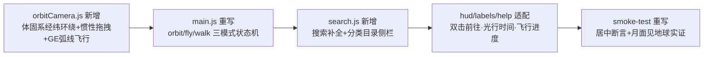

# 变更文档 (Phase 3)

> 项目：Heliosphere — 太阳系 1:1 实时自由探索游戏（全新工程，全部为新增文件）

## 1. 变更摘要

从零实现完整可玩的太阳系 1:1 模拟游戏：真实星历（JPL 数据验证）、NASA 实测贴图、物理大气散射、行星登陆行走、6DOF 飞船、日球层全内容。

## 2. 变更原因

对应 `analysis-document.md` F1–F18 全部需求（用户三轮要求：3A 级、1:1 真实、NASA 贴图、物理正确、可登陆、日球层完整、任意悬停）。

## 3. 实现流程

## 4. 文件变更详情（全部新增）

| 文件 | 行数(约) | 用途 |
|------|------|------|
| `src/astro/time.js` | 90 | UTC→TT→JD、ΔT（2017 后取 69.184s 精确值）、SimClock |
| `src/astro/kepler.js` | 80 | 开普勒方程（牛顿+二分兜底）、根数→黄道坐标 |
| `src/astro/planets.js` | 120 | JPL Standish 元素表、行星位置（地球由地月质心反推） |
| `src/astro/moon.js` | 55 | 截断 ELP 月球（含 J2000 岁差回转） |
| `src/astro/moons.js` | 60 | 拟合根数传播、轨道法向、轨道线采样 |
| `src/astro/moonsData.generated.js` | 生成 | 21 颗卫星密切根数（Horizons 实测拟合 + 双历元速率修正） |
| `src/astro/rotation.js` | 110 | IAU 极轴/W 模型、潮汐锁定矩阵、日下点 |
| `src/astro/bodies.js` | 230 | 30+ 天体物理库（半径/GM/大气/地表/环/中文资料） |
| `src/engine/floating.js` | 45 | 浮动原点世界（double 绝对坐标 − 相机） |
| `src/engine/ship.js` | 250 | 输入系统、6DOF 飞船、行走模式（体固系、真实 g） |
| `src/engine/autopilot.js` | 60 | 转向+距离比例减速剖面 |
| `src/scene/builder.js` | 300 | 总装配、贴图管线、星历驱动更新 |
| `src/scene/sun.js` | 110 | 太阳米粒着色器 + 日冕 + 光晕 |
| `src/scene/planetMaterial.js` | 130 | 昼夜混合/城市灯光/海洋高光着色器 |
| `src/scene/atmosphere.js` | 150 | 单次散射光线步进（16×6 采样，Rayleigh+Mie） |
| `src/scene/rings.js` | 110 | 行星环（径向贴图、透射、行星本影） |
| `src/scene/starfield.js` | 90 | 银河贴图球（银道定向）+ 12k 程序化恒星 |
| `src/scene/belts.js` | 80 | 主带/柯伊伯带点云 + 黄道尘光 |
| `src/scene/comets.js` | 120 | 4 颗真实彗星 + 反日彗尾 |
| `src/scene/heliosphere.js` | 130 | 终止激波/日球层顶（Parker 形状）+ 旅行者号 |
| `src/scene/terrain.js` | 220 | 登陆地形：HeightField + 环形 LOD + 贴图颜色融合 |
| `src/scene/proceduralTextures.js` | 120 | 离线兜底贴图 |
| `src/ui/labels.js` / `hud.js` | 220 | 标签投影/准星选择、中文 HUD |
| `src/main.js` | 330 | 主循环集成、雾/曝光、按键路由 |
| `src/config.js` / `util/noise.js` | 160 | 坐标约定、确定性噪声 |
| `index.html` / `src/style.css` | 280 | 启动屏/帮助/HUD 样式 |
| `tools/*.mjs` ×6 | 500 | Horizons 客户端/验证/拟合/贴图下载/冒烟测试/基准生成 |
| `tests/*.test.mjs` ×4 | 330 | 33 项单元与精度测试 |
| `public/textures/*` | 21 文件 | NASA/USGS 实测贴图（约 80MB，含 8K 地月火木） |

## 5. 关键修改记录（开发期缺陷修复）

| # | 问题 | 修复 |
|---|------|------|
| 1 | 行走模式三处朝向数学错误（东向取反/偏航符号/lookAt 目标） | 实现后即审中修正 |
| 2 | 黄赤交角旋转方向反（日下点纬度 −23° 应 +23°）| `rotation.js` 改 `Rx(+ε)`，被单测捕获 |
| 3 | ΔT 用过时预测公式（75.3s 实际 69.184s） | 2017 年后取精确常数 |
| 4 | 大气/泛光过曝（地球发白） | uSunI 22→13、bloom 0.55→0.38、气巨 multiplier 2→0.8 |
| 5 | 自动驾驶取消后残留数百倍光速 | 取消时钳制到速度档 |
| 6 | 轨道线历元硬编码 | 改为启动时系统时间 |
| 7 | 内层卫星 +10 天相位漂移 7.5° | 双历元实测速率修正 → 0.057° |

## 5.5 第二轮迭代：Google Earth 交互范式（F19–F22，2026-06-10）

| 变更 | 内容 |
|------|------|
| 新增 `src/engine/orbitCamera.js` | GE 式环绕相机：焦点天体体固系 (lat,lon,dist) 锚定（随公转/自转）、拖拽惯性、滚轮指数缩放、北极朝上、焦点恒居中；flyTo 飞行动画：对数高度剖面+正弦弧线+视线前 60% 渐进锁定目标+日照面到达，时长 1.8–7s 随距离对数缩放，拖拽可中断 |
| 新增 `src/ui/search.js` | GE 式搜索框（中/英/拼音 id 补全、键盘导航）+ 天体目录侧栏（恒星/行星/矮行星/卫星按母星分组/彗星/探测器/日球层边界，点击即前往） |
| 重写 `src/main.js` | 三模式状态机：orbit(默认,自由光标)/fly(指针锁定)/walk；Esc 退出飞行回探索；行走 G 返回探索；T/数字键/双击/搜索/目录统一走 flyTo；新增日球层边界地标（终止激波/日球层顶鼻尖，可前往） |
| 修改 `ship.js Input` | 非锁定左键拖拽通道、输入框打字防穿透、锁定状态回调 |
| 修改 `hud.js` | 模式显示（🌐探索/✈飞行动画+进度）、信息面板增加实时距离+**光行时间**+距太阳 AU（求知向） |
| 修改 `labels.js` | 双击标签 = GE 式前往 |
| 删除 `autopilot.js` | 被 GE 飞行动画取代 |
| 沉浸细节 | 行走模式自动隐藏轨道辅助线；探索模式隐藏准星 |

## 5.6 第三轮迭代：缺陷修复 + GE 键盘 + NMS 地表（2026-06-10）

| # | 变更 | 内容 |
|---|------|------|
| 1 | **修复半屏发亮 bug（用户截图报告）** | 根因：`createBelts()`/`createHeliosphere()` 组未注册浮动原点系统，错误地以相机为中心渲染（黄道尘光盘 6 AU 大平面糊住半屏）。修复：注册 `world.register(zeros, group)` 使其正确以太阳为中心；同时尘光透明度 0.16→0.11 | 
| 2 | **Google Earth 完整键盘方案** | 探索模式：`W S A D`/方向键平移（屏幕空间、随航向旋转、速率随高度缩放、经度按 cos(lat) 补偿）；`Shift+A/D` 旋转航向；`Shift+W/S` 倾斜看向地平/回俯视；`PageUp/PageDown` 与 `+/−` 指数缩放；`R` 复位北向俯视；拖拽方向随航向旋转 |
| 3 | **NMS 级地表渲染（所有可登陆天体）** | ① 高度场升级：大尺度构造+山地链掩码+双尺度撞击坑+三层细节频率（~2km/200m/40m 波长）；② 新增最内 LOD 环（3m 格距）；③ 坡度岩壁化配色（法线二次遍历）；④ 片元级三尺度细节噪声注入（28m/2.4m/20cm，对象空间稳定）；⑤ 世界锚定确定性岩石散布（InstancedMesh ≤320 块/0.4–2.4m，体固系整数格哈希，重建不漂移）；⑥ 行走夜面微环境光（地照） |
| 4 | **飞行动画墙钟化** | 进度改用 performance.now（低帧率设备跳帧前进，固定真实时长，GE 行为） |

## 5.7 第四轮迭代：逼真度+交互+科教（2026-06-10）

| # | 变更 | 内容 |
|---|------|------|
| 1 | 土星环 NASA 配色 | 环着色器加 `uTint` 色调（卡西尼实拍淡金褐 [1.35,1.16,0.88]）+ 冰粒掠射散射项（2025 环平面分点后太阳低掠射角下仍保持可见亮度，符合实拍特征）；天王星环暗炭灰 |
| 2 | 行走 360° 视角 | 解除 pitch ±89° 钳制 → 全周连续环视（含翻转过顶），消除钳制边界的快速旋转问题 |
| 3 | 右键空间平移 | orbitCamera 增加 `panOffset`（体固系）：右键/中键拖拽时整个空间跟随鼠标平移、零旋转；R 复位；含天体内部防穿透径向推出 |
| 4 | 搜索下拉增强 | 点击搜索框即显示默认列表：🛤 轨道线显示/隐藏开关（点击切换、状态实时）+ 8 个热门目的地 |
| 5 | 科教知识系统 | `ui/eduFacts.js`：60+ 条真实天文知识卡片（25 天体专属 + 通用），信息面板"📚 你知道吗"循环展示，"换一条"交互 |
| 6 | SpaceEngine 级地表 | 片元程序化凹凸（屏幕导数法）+ 三尺度细节随距离淡出（防远处沙噪）+ 大尺度地块色调变化；**修复 float32 精度乱纹**：片元噪声坐标改为"玩家附近噪声原点"相对坐标（每 2km 重吸附） |
| 7 | GE 旋转限制核查 | 确认仅纬度一个方向受 ±86° 限制（GE 同款），经度/航向/行走偏航俯仰均无限循环 |

## 5.8 第五轮迭代：取消纬度限制——极点穿越翻转（2026-06-10，经评估确认）

经评估：GE 保留纬度限制的两个理由（lookAt 极点退化、地图北朝上心智模型）在本三维太空模拟中均不成立，且 ±86° 钳制阻挡了土星北极六边形、极区冰坑、天王星极轴朝阳等核心科教视角。

**方案**：chart flip——纬度越过 ±90° 时 `lat→180°−lat、lon+=180°、heading+=180°、vLat 反号`，相机位置与画面严格连续；lookAt 永不在退化点求值。配合既有 heading 自由与 R 复位，方向感可随时找回。

**实测**：北纬 80° 持续向北平移穿越北极——最高 89.7° 后连续回落、经度翻转 180°、帧间姿态变化峰值仅 10.6°（无跳变）。至此**所有视角维度（纬/经/航向/倾斜/行走偏航俯仰/飞行姿态）全部无限循环**。

## 5.9 第六轮迭代：全局 NASA 真实性审查（2026-06-10，全行星截图逐项核验）

| # | 审查发现 → 改进 | NASA 依据 |
|---|------|------|
| 1 | **环影投射到行星本体**：片元沿太阳方向与环面求交、采样环纹理光学深度遮挡直射光（土星贴图环/天王星解析环均支持） | 卡西尼实拍标志性特征 |
| 2 | **真实亮星目录**：21 颗全天最亮恒星（依巴谷 RA/Dec/星等/色温），含中文星名与光年距离标签（天狼 8.6 ly、北极星 433 ly…） | 依巴谷星表 |
| 3 | **白昼星空淡出**：身处大气稠密层且日照时星空/银河/星标签平滑淡出（日光散射淹没星光的物理事实）；带点云同步隐藏 | 任何地表白昼实拍 |
| 4 | **标签球体遮挡**：贴近天体时地平线下/天体背面的标签隐藏（视线-球求交测试） | — |
| 5 | **地球海面**：深海蓝配色取代贴图浅蓝×噪声的大理石纹；海面不再散布岩石 | — |
| 6 | **火星白昼天空**：奶油黄褐色（尘埃红光散射 βR 红主导 + Mie 增强），不再黑天见星 | 海盗号/毅力号地表实拍 |
| 7 | **太阳特写曝光**：近日处曝光下限 0.7→0.25，保留米粒组织细节 | SDO 影像观感 |

审查通过项（无需修改）：木星 8K 特写、金星浓雾地表（Venera 观感）、土星环淡金色、月/水地表、大气弧光、银河指向。

## 6. 配置/接口/数据库变更

- 无外部数据库；无对外接口。`public/textures/manifest.json` 为资产清单。
- npm scripts：`dev / build / preview / test / fetch-textures / fit-moons / verify`。

## 7. 回滚方案

全新目录工程，回滚 = 删除目录。生成文件（moonsData/fixtures/textures）可由 tools 脚本随时重建。

## 5.10 第七轮迭代：无缝着陆连续体 + SpaceEngine 级视觉 + GPU 自适应（2026-06-11）

### 变更明细（对应 R7 #1–#8）

| # | 变更 | 文件 | 内容 |
|---|------|------|------|
| 1 | **无缝着陆连续体** | orbitCamera/ship/main/terrain | ① `minDist` 地形感知：当前方向 `heightFn + 1.7m`（与行走碰撞同源，滚轮可一路落地，旧值停在地表上方 25.5km）；② 近地自动倾斜 `80°×(1−alt/startAlt)^1.6`（俯视→近地平连续过渡）；③ 贴地 `alt<2.2m` 自动转行走（`enterWalk` 同时反解 yaw+pitch，视向严格连续）；④ 行走中滚轮后退 = 无缝起飞回探索（`adoptPosition(quat)` 反解 heading/tilt，复现偏差 <2°）；⑤ 地形 LOD 重建分帧（每帧最多 1 级，消除一帧 6 级全量重建卡顿） |
| 2 | **行走鼠标方向一致** | ship.js | `w.yaw -= dx` → `+=`（鼠标右移=向右看） |
| 3 | **杜绝快速旋转，无限制 360°** | ship.js | 输入层每事件钳制 ±150px（Chromium 指针锁定尖峰）；行走灵敏度 0.0022→0.0011 + 指数平滑 τ=50ms；俯仰/偏航保持 360° 连续无钳制；未锁定指针时左键拖拽环视兜底 |
| 4 | **外行星 SpaceEngine 级** | planetMaterial/builder | 片元程序化细节（分辨率无关，按视半径淡入，远观零变化）：气巨/冰巨=纬向拉伸湍流双尺度+风暴涡+临边昏暗；岩质=各向同性中尺度细节；**人眼暗适应补偿** `I<1 → I^0.55`（仅太阳光照通道：行星/云/环/大气/地形光源，星空与曝光不受影响，地球处=1）——海王星/冥王星不再近黑 |
| 5 | **大气进入逼真过渡** | atmosphere/main/bodies(未改) | 气巨/冰巨 `minDistKm=R×1.0012` 允许下潜至云甲板上空；大气着色器 `uBoost` 密度增幅（仅相机在大气内的气巨，**在大气外恒 1 → R5 外观逐位一致**，离开时复位已验证）；全屏浸没层 `#immersion`（色调取自该行星散射系数，深处白化吞没）；HUD 入气提示 |
| 6 | **指针中心缩放** | orbitCamera/ship/main | 滚轮时捕获光标射线∩焦点球的体固锚点 P；缩放期间每帧定点迭代 ×3 把"当前命中 H→P"球面旋转施加到相机径向（锚点零累积漂移，实测 <0.02 rad）；单次限角 0.12 rad 防跳变；无交点/空间平移时退化为中心缩放；PageUp/Down 保持屏幕中心缩放 |
| 7 | **3D 镜头操控体系** | orbitCamera/ship/main | 拖拽灵敏度随离地高度收敛（`0.00123×alt/R`，"抓住地面拖动"手感）；键盘平移下限 0.015→3e-6 rad/s（旧值在地面=95km/s 失控）；Ctrl+左键拖拽=旋转航向/倾斜；探索⇄行走⇄飞行全部位姿连续接管；既有极点穿越翻转保留，全维度 360° 循环 |
| 8 | **GPU 自适应** | quality.js(新增)/main/atmosphere/terrain/builder | `powerPreference:'high-performance'`（多显卡选独显）；`WEBGL_debug_renderer_info` 识别 SwiftShader/核显→lite 档（像素比 1、泛光 1/4、 大气步进 8/3、地形网格 48、各向异性 2、细节着色器关）；URL `?quality=high|lite` 手动覆盖；运行时 FPS<28 持续 4s 一次性降档兜底 |

### 文件 diff 统计（最小修改证据）

| 文件 | 变更 |
|------|------|
| `src/engine/quality.js` | **新增** 70 行 |
| `src/engine/orbitCamera.js` | +约 150 / −约 25 行（minDist/自动倾斜/锚定缩放/姿态反解） |
| `src/engine/ship.js` | +约 45 / −约 12 行（Input 钳制+通道、行走视角、enterWalk 俯仰） |
| `src/main.js` | +约 95 / −约 20 行（接线/状态机/浸没层/FPS 兜底） |
| `src/scene/planetMaterial.js` | +约 55 行（细节着色器+临边昏暗，detailMode=0 时零开销） |
| `src/scene/atmosphere.js` | +4 行（uBoost、步进数模板化） |
| `src/scene/terrain.js` | +8 / −5 行（分帧、网格分档） |
| `src/scene/builder.js` | +14 行（细节传参、暗适应补偿、段数/各向异性分档） |
| `index.html` / `src/style.css` | +浸没层 div/样式、帮助文案更新 |
| `tools/repro-r7.mjs` / `probe-r7.mjs` / `probe-r7-visual.mjs` | **新增**（复现/运行时验证/视检） |
| **未触碰** | `src/astro/**`、`floating.js`、`rings.js`、`sun.js`、`starfield.js`、`comets.js`、`belts.js`、`heliosphere.js`、`ui/**` |

### 副作用自查清单

- ✅ 星历层零改动 → `npm test` 33/33。
- ✅ 大气在相机位于大气外时 `uBoost=1`，片元数学与 R5 审查版严格相等；探针实证离开大气后复位为 1。
- ✅ 行星材质 `uDetailMode=0`（低档/降档）跳过全部新分支；细节按视半径淡入，远观与原版一致。
- ✅ 暗适应补偿在辐照 ≥1（地球及更近）恒等原值，内太阳系 R5 审查外观不变。
- ✅ 旧冒烟测试（GE 全流程 + 月面行走 + 日球层）全部通过、0 控制台错误。

### 开发期缺陷修复记录（本轮实现中发现）

| # | 问题 | 修复 |
|---|------|------|
| 1 | 指针锚定收敛系数按中心距推导 → 锚点漂移 0.96 rad | 改为离表高度比 → 0.16，再改为"H→P 球面旋转逐帧重钉+定点迭代×3" → <0.02 rad |
| 2 | 键盘平移速率下限 0.015 rad/s 在新最低高度（地面 1.7m）≈95 km/s 失控 | 下限改 3e-6 rad/s（地球地面 ≈19 m/s） |
| 3 | 外行星在真实 1/d² 辐照下近黑（曝光上限受星空制约无法补偿） | 太阳光照通道人眼暗适应压缩 I^0.55（仅 I<1），星空/曝光不受影响 |

## 5.11 第八轮迭代：气巨大气边界修复 + 屏幕中心缩放（2026-06-11）

| # | 变更 | 文件 | 内容 |
|---|------|------|------|
| 1 | 大气圆圈线 | atmosphere.js | 抖动项 +dith → +dith×alpha（旧实现无条件叠加在壳投影盘上，外太阳系高曝光下显形为 Ra 圆圈线） |
| 2 | 大气双边界 | atmosphere.js / builder.js | 射线求交椭球化（拉伸空间法，t 参数共享；新增 uAxis/uStretch，可登陆体 uStretch=0 数学恒等）；builder 每帧更新 uAxis=自转轴 |
| 3 | 屏幕中心缩放 | orbitCamera.js | 移除 R7 指针锚定（用户修订需求）；倾斜/平移时缩放改为沿视线推拉：深度=屏幕中心命中天体（实时）或锚点投影（捕获后随推进递减），位移吸收进 panOffset、姿态参数不变 → 中心目标严格居中；防穿入二次钳制；无目标停止推进 |
| 4 | 中心命中探测 | main.js | orbitEnv.centerDepth：全天体射线求交取最近命中（R≥1km，含表面余量）—— 太阳居中后滚轮收敛到日面上空 |
| 5 | 滚轮归一化 | ship.js | wheel += sign(deltaY)×min(\|deltaY\|/100, 1)，相机端按帧钳制 ±3（高速滚轮无离散跳跃）；行走起飞阈值 ≥0.5 防触控板误触 |
| 6 | 清理 | ship.js / main.js / index.html | 移除光标 NDC 追踪与组装、TAN_HALF_FOV；帮助文案改"以屏幕中心拉近/拉远" |

**开发期缺陷修复**：① dolly 深度回退 this.dist → 越过锚点后匀速冲越 26R（改为无目标停止推进）；② 位移吸收进 panOffset 后锚点投影平移不变 → 深度恒定不收敛（改为参考深度独立捕获并随推进递减）。两者均被 repro-r8 逐帧插桩捕获。

**副作用自查**：可登陆行星 uStretch=0 椭球式退化为原式（地球/火星/金星/土卫六大气零回归）；用户 tilt=0 且未平移时缩放路径与 R7 完全一致（着陆流程探针回归通过）；星历层零改动 33/33。
