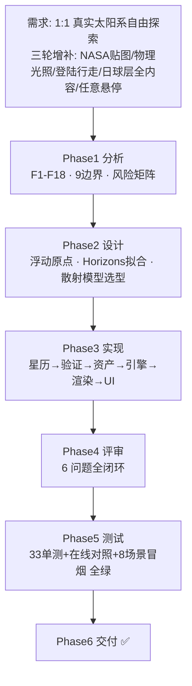

# 交付总结 (Phase 6)

> **Heliosphere 日球层** — 太阳系 1:1 实时自由探索游戏 ｜ 2026-06-10 交付

## 1. 交付物清单

| 类别 | 内容 |
|------|------|
| 游戏本体 | `npm run dev` 即玩；`npm run build` → `dist/` 静态产物 |
| 源码 | `src/`（astro/engine/scene/ui 四层，~3100 行） |
| 资产 | `public/textures/` 21 张 NASA/USGS 实测贴图（含 8K 地/月/火/木）+ 程序化兜底 |
| 工具链 | `tools/`：Horizons 验证、卫星拟合、贴图下载、基准生成、浏览器冒烟 |
| 测试 | `tests/` 33 项（含 JPL 离线基准）+ 8 场景端到端 |
| 文档 | `docs/sdlc/`：analysis / design / change / review / test-cases / test-report / delivery-summary + 截图 |

## 2. 全流程图



## 3. 需求达成核对

| 需求 | 达成 | 证据 |
|------|------|------|
| 根据系统时间精确还原此刻太阳系 | ✅ | 与 JPL Horizons 实时对照：行星 ≤0.074°，月球 0.12°，卫星历元 0.000° |
| 1:1 比例日球层 | ✅ | 全部 km 真值；浮动原点+对数深度，0.5m–120AU 无抖动 |
| NASA 实测贴图 | ✅ | 20/23 实测图（SSS CC-BY-4.0 / Steve Albers SOS / JPL PIA11707），3 个程序化兜底 |
| 物理光照 | ✅ | 1/d² 辐照、HDR+ACES、昼夜晨昏线实时正确（单测锁定）、城市夜灯、海洋高光 |
| 物理大气 | ✅ | Nishita 单次散射（实测 β 谱）：太空蓝边/地面蓝天/晨昏红/火星橙/金星浓雾/土卫六霾 |
| 登陆行走（无人深空式） | ✅ | 19 颗固体天体可登陆；环形 LOD 地形+真实贴图颜色；真实 g（月球 1.62 实证）；跳跃/奔跑 |
| 日球层全内容 | ✅ | 8行星+冥王星+21卫星+主带+柯伊伯带+4彗星(反日尾)+黄道尘+终止激波+日球层顶+旅行者1/2 |
| 任意位置悬停 | ✅ | 惯性阻尼+X 急停；接近自动限速 |
| 时间系统 | ✅ | 实时起步、±1s–±10年/s、暂停、回到现在 |
| 中文沉浸 UI | ✅ | HUD/标签/信息面板/帮助全中文，30+ 天体中文百科 |

### 3.5 第二轮迭代验收（Google Earth 范式，F19–F22）

| 需求 | 达成 | 证据 |
|------|------|------|
| GE 操作范式扩展到日球层 | ✅ | 默认探索模式：体固系锚定环绕、拖拽惯性、滚轮缩放、焦点恒居中（任意天体） |
| GE 式动态前往（T/搜索） | ✅ | 签名弧线飞行动画 1.8–7s，到达木星后居中环绕（冒烟断言 focus=jupiter） |
| 地点搜索 + 学习目录 | ✅ | 中英文补全搜索、分类目录侧栏、信息面板含光行时间/实时 AU 距离 |
| 月面行走见地球 | ✅ | 实测截图 07：地球标签 (800,180) 居屏幕正中，蓝色地球悬于月球星空 |

## 4. 关键决策记录

1. **星历方案**：行星用 JPL Standish 元素（1800–2050 角分级）而非完整 VSOP87 —— 工作量/精度平衡，且以 Horizons 在线验证兜底。
2. **卫星方案**：Horizons 实测状态向量拟合密切根数 + 双历元速率修正，"此刻"零误差优先。
3. **比例方案**：拒绝缩放比例尺，采用相机相对渲染（CPU double 减法）满足真 1:1。
4. **天王星极轴**：遵循 IAU/WGCCRE 北极约定（倾角 82.2°+逆行 ≡ 教科书 97.8°）。
5. **资产策略**：在线多源下载 + manifest + 程序化兜底，断网可玩。

## 5. 已知限制

见 `review-document.md` §5：卫星长期 J2 进动未建模、无日月食投影、大气壳无深度感知、地形为风格化噪声+真实反照率（非 DEM）、静态云图。

## 6. 后续建议

- 接入 USGS DEM 瓦片实现真实地形（月球/火星 LOLA/MOLA）
- 日月食阴影体；环对行星投影
- 声音设计（无线电氛围/登陆脚步声按介质）
- 存档系统（玩家位置/时间书签）
- VSOP87 + ELP2000 完整理论扩展有效期至 ±3000 年

## 7. 运行方式

```bash
npm install        # 首次
npm run dev        # 开发模式 → http://localhost:5173
npm run build      # 生产构建 → dist/
npm test           # 33 项测试
npm run verify     # 与 NASA JPL Horizons 实时对照（需联网）
```

---

# R7 交付总结（2026-06-11）

## 交付物

- 代码：8 文件修改 + `src/engine/quality.js` 新增；构建 607.99 kB（gzip 172.85 kB）✅
- 文档：analysis/design/change/review/test-cases/test-report 各增 R7 章节 + `reproduction-document.md` 新建
- 工具：`tools/repro-r7.mjs`（复现/验证）、`tools/probe-r7.mjs`（运行时探针）、`tools/probe-r7-visual.mjs`（高档视检）
- 截图：`docs/sdlc/screenshots/r7-*.png`（自动登陆/起飞/木星入气/外行星高档近景）


## 关键决策

1. **锚定缩放**用"球面旋转逐帧重钉 + 定点迭代×3"而非解析解 —— 与 tilt/heading/惯性/极点翻转天然兼容，漂移 <0.02 rad。
2. **入气效果**用大气着色器密度增幅（大气外恒 1）+ 全屏浸没层 —— 数学上保证 R5 审查外观零回归。
3. **外行星亮度**用太阳光照通道人眼暗适应压缩 I^0.55（仅 I<1）而非提高全局曝光 —— 星空不冲爆，地球及内太阳系恒等。
4. **外行星细节**走 SpaceEngine 程序化路线（分辨率无关）而非高清贴图 —— 天王/海王公开源仅 2K（实测上限），冥王 8K 源不可达（SSL 超时）。

## 已知限制（新增/更新）

1. 指针锚定缩放在空间平移（panOffset≠0）时退化为中心缩放（设计取舍，文档化）。
2. 自动登陆需指针锁定授权；个别浏览器拒绝滚轮手势锁定时回退为"左键拖拽环视 + 提示单击锁定"。
3. 气巨下潜下限为云甲板上空（R×1.0012），不模拟更深层（无实测数据且压强物理上不可达）。
4. lite 档判定依赖 WEBGL_debug_renderer_info；不可用时默认高档 + 运行时 FPS 兜底（可 ?quality=lite 手动强制）。

## 后续建议

- 行走模式输出脚步/环境声（依据介质：有气/真空）。
- 气巨入气增加程序化云层体积感（视差层）。
- 锚定缩放扩展到卫星环绕母星视角（当前锚定焦点天体本体）。

---

# R8 交付总结（2026-06-11）

- **#1 气巨双边界/圆圈线**：根因=抖动项全盘叠加（圆圈线）+ 正球求交 vs 压扁网格（双边界）。修复=抖动×alpha + 拉伸空间椭球求交（uAxis/uStretch，可登陆体数学恒等）。before/after 截图在 docs/sdlc/screenshots/r8-*.png。
- **#2 屏幕中心缩放**：根因=缩放向"焦点+平移锚点"收敛而视线（倾斜/平移后）不指向锚点 + 滚轮按事件整格累计。修复=滚轮/PageUp/Dn 统一屏幕中心语义：常规径向缩放不变；倾斜/平移时沿视线推拉，深度取屏幕中心命中天体（太阳居中即收敛到日面上空），滚轮 deltaY 归一化。R7 指针锚定缩放按用户修订移除。
- 工具：tools/repro-r8.mjs（3 场景量化断言）、tools/probe-r8-shot.mjs（before/after 同机位截图）。
- 修改行数：约 +120/−95（4 个源文件 + 帮助文案），星历层/地形/行走/UI 零改动。

---

# R9 交付总结（2026-06-12）

## 根因与修复一览
1. **平移后缩放跳回原焦点**：推拉目标逐帧实时重定 + 全语义绑死旧焦点 → 焦点交接（centerHit→adoptPosition 视向连续）+ 手势锁靶。右键平移+滚轮现可一路接近并登陆任何天体。
2. **行走快速旋转**：帧级累计无上限+卡顿帧倾泻+指针锁定突发 → 帧钳 ±260px + dt≤33ms 平滑 + 150ms 锁定静默 + 灵敏度 0.00085。
3. **远离无界**：上限 250 AU（日球层顶全景即停）；飞行模式同界；缩放灵敏度轻拨精细/连滚渐加速。
4. **惯性观察模式（V）**：锚定系切换观赏卫星绕转，切换严格连续。
5. **登陆闪烁**：fp32 顶点量化（235mm@6371km）→ 级原点相对几何（亚毫米）+LOD 环带 polygonOffset+新增 1m 格距层。
6. **海洋**：可下潜（海床=固体面）、水面波纹镜面反射、深海雾+光照指数衰减、水下行走浮力物理、穿云薄纱。
7. **天体真实性**：火卫一/二真实三轴椭球（视觉=碰撞同源）；冥王星换新视野号真实拼图（心形）；titan/callisto 实贴图。

## 最小修改证据
7 个源文件 + 3 张贴图 + 2 个新工具脚本；星历/大气/画质核心零触碰；全回归绿（repro-r7/r8/r9 + 单元 33 + 双探针 + 冒烟，0 控制台错误）。
