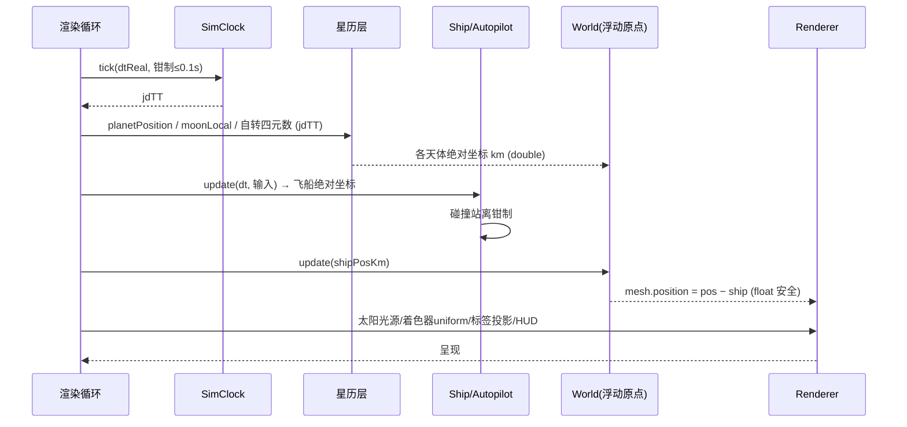
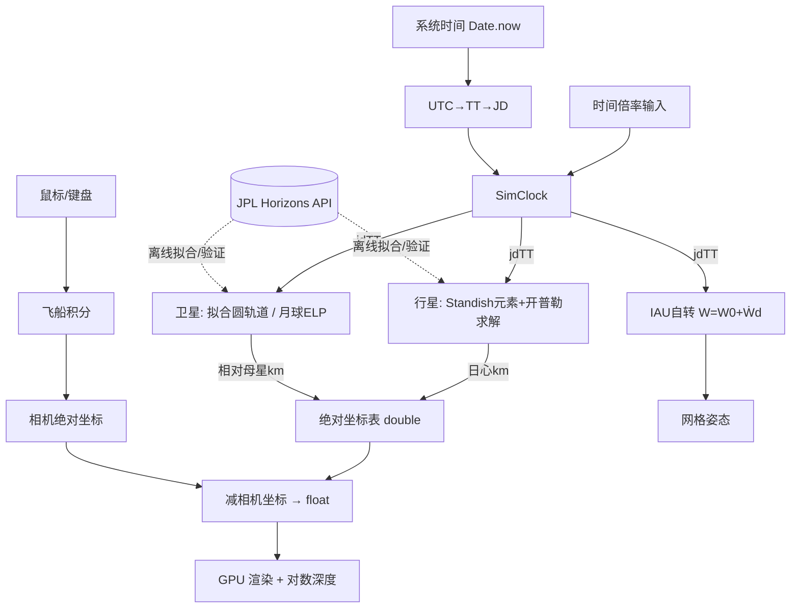
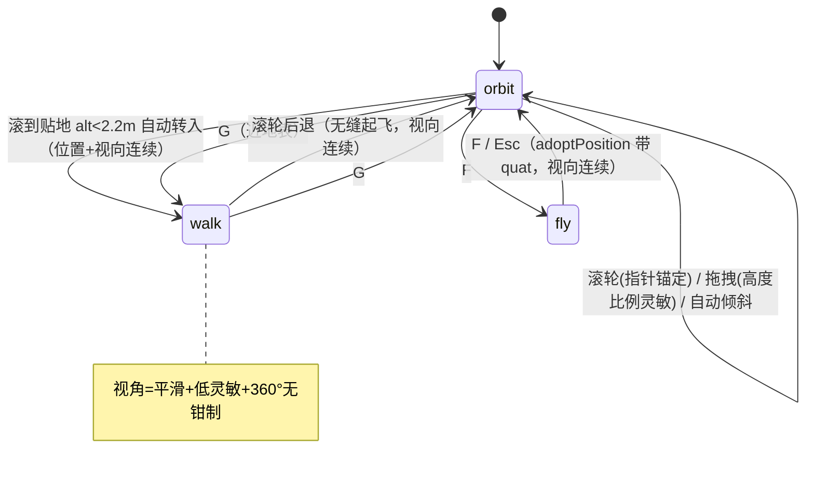
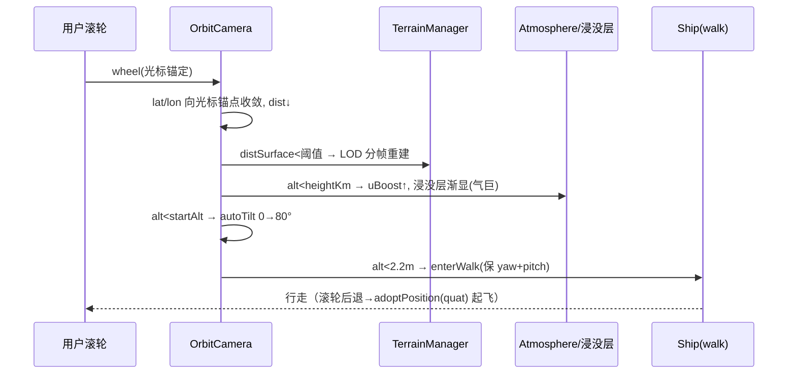
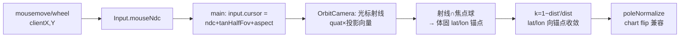
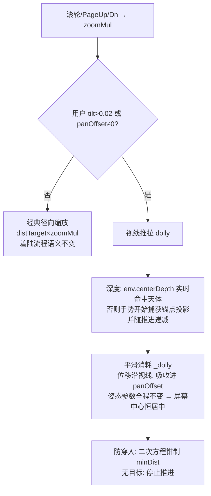

# 设计文档 (Phase 2)

> 项目：**Heliosphere — 太阳系 1:1 实时自由探索游戏**

## 1. 设计方案概述

浏览器端 WebGL2 游戏：Vite + Three.js + 原生 ESM JavaScript。星历层为纯函数模块（可在 Node 中单测并与 JPL Horizons 对照）；渲染层采用**相机相对渲染（浮动原点）+ 对数深度缓冲**实现 1:1 千米级比例；卫星轨道参数由 **Horizons 实测状态向量拟合脚本**离线生成并固化进仓库，运行时零网络依赖。

## 2. 方案对比与选择

| 维度 | 方案 A：Vite + Three.js（npm 本地依赖） | 方案 B：单 HTML + CDN | 方案 C：原生引擎(Unity/UE) |
|------|------|------|------|
| 离线可运行 | ✅ 依赖装入 node_modules | ❌ 依赖 CDN | ✅ |
| 一键启动/构建 | ✅ `npm run dev` | ✅ 但无模块化 | ❌ 需安装巨型工具链 |
| 可测试性 | ✅ `node --test` 测纯函数 | ⚠️ 困难 | ⚠️ |
| 代码组织 | ✅ ESM 多模块 | ❌ 数千行单文件 | ✅ |
| 本环境可交付 | ✅ | ✅ | ❌（无 Unity/UE） |

**选择：方案 A。**

坐标精度方案对比：
- A1 缩小比例尺（如 1 单位=10⁶ km）：近表面仍抖动，且违背 1:1 要求 ❌
- A2 **浮动原点（相机相对渲染）**：CPU 端 double 存绝对坐标（km），每帧上传 `pos - cameraPos`，GPU 只见相对小量 ✅（选用，配合 `logarithmicDepthBuffer`）

卫星星历方案对比：
- M1 完整解析理论（ELP/GUST86/TASS）：工作量巨大 ❌
- M2 **Horizons 状态向量拟合圆轨道**（轨道面法向+历元相位取自 NASA 实测，周期取文献值）：当前时刻精确、数十年内相位误差小 ✅（选用；月球例外，用截断 ELP 解析式）

## 3. 架构图

```mermaid
flowchart LR
    subgraph astro [astro 星历层 · 纯函数可单测]
        time[time.js<br/>UTC→TT→JD·仿真时钟]
        kepler[kepler.js<br/>开普勒方程求解]
        planets[planets.js<br/>JPL Standish 元素]
        moon[moon.js<br/>截断ELP月球]
        moons[moonsData.generated.js<br/>Horizons拟合卫星]
        rotation[rotation.js<br/>IAU自转模型]
        bodies[bodies.js<br/>物理数据/中文资料]
    end
    subgraph engine [engine 引擎层]
        floating[floating.js 浮动原点]
        ship[ship.js 6DOF飞船]
        ap[autopilot.js 自动驾驶]
    end
    subgraph scene [scene 渲染层]
        builder[builder.js]
        sun[sun.js 太阳着色器]
        pm[planetMaterial.js 昼夜/大气]
        rings[rings.js 行星环]
        stars[starfield.js 亮星表+银河]
        belts[belts.js 小行星/柯伊伯带]
        helio[heliosphere.js 日球层]
        tex[proceduralTextures.js 兜底贴图]
    end
    subgraph ui [ui 交互层]
        hud[hud.js 中文HUD]
        labels[labels.js 标签/选星]
    end
    tools[tools/: fetch-textures · fit-moons · verify-ephemeris] -.离线生成/验证.-> astro
    astro --> engine --> scene --> ui
    main[main.js] --> astro & engine & scene & ui
```



## 4. 关键接口定义

```js
// astro/time.js
dateToJD(date: Date): number                  // UTC → 儒略日(UT)
jdUTtoTT(jd: number): number                  // +ΔT(~69s)/86400
class SimClock { jdTT; rate; paused; tick(dtReal); setNow(); }

// astro/kepler.js
solveKepler(M: rad, e): E                     // 牛顿迭代+二分兜底, |f(E)|<1e-12
orbitalToEcliptic(a,e,I,L,peri,node, …): {x,y,z}  // km, 日心黄道 J2000

// astro/planets.js
PLANETS: string[]
planetPosition(name, jdTT): {x,y,z}           // km, heliocentric ecliptic J2000
planetOrbitPoints(name, jdTT, n): Float64Array // 轨道线采样

// astro/moon.js
moonGeocentric(jdTT): {x,y,z}                 // km, geocentric ecliptic J2000

// astro/moonsData.generated.js  (由 tools/fit-moons.mjs 生成)
MOONS: { id, name, parent, radiusKm, periodDays,
         aKm, nHat:[x,y,z], lon0:rad, epochJd }[]
moonLocalPosition(m, jdTT): {x,y,z}           // km, 相对母行星, ecliptic J2000

// astro/rotation.js
bodyQuaternionWorld(bodyId, jdTT): THREE.Quaternion  // 体固→three世界
subsolarLongitude(bodyId, jdTT, sunDirEcl): deg      // 用于测试

// engine/floating.js
class World { register(entity{posKm:Float64Array, object3D});
              update(cameraPosKm) }            // mesh.position = pos - camera

// engine/ship.js
class Ship { posKm:[x,y,z](double); quat; speedIndex; update(dt, input);
             clampToSurface(bodies) }          // 碰撞站离

// engine/autopilot.js
class Autopilot { engage(targetBody); update(dt, ship): bool /*arrived*/ }
```

坐标系约定：**计算统一用日心黄道 J2000、单位 km**；映射到 three 世界系 `(x,y,z)_ecl → (x, z, -y)_three`（黄道北极为 +Y，proper rotation）。同一映射亦用于体固系→网格本地系，经检验与 three `SphereGeometry` 的 UV 展开相容（本初子午线=本地 +X，北极=+Y）。

## 5. 时序图（一帧）



## 6. 数据流图



## 7. 文件变更清单（全部新增）

| 路径 | 用途 |
|------|------|
| `package.json` / `vite.config.js` / `index.html` | 工程骨架（dev/build/test/fetch-textures/fit-moons/verify 脚本） |
| `src/main.js`, `src/config.js` | 引导、常量 |
| `src/astro/{time,kepler,planets,moon,rotation,bodies}.js` | 星历核心 |
| `src/astro/moonsData.generated.js` | 拟合卫星数据（脚本生成，入库） |
| `src/engine/{floating,ship,autopilot}.js` | 引擎 |
| `src/scene/{builder,sun,planetMaterial,atmosphere,rings,starfield,belts,heliosphere,proceduralTextures}.js` | 渲染 |
| `src/ui/{hud,labels}.js`, `src/style.css` | 界面（中文） |
| `tools/{fetch-textures,fit-moons,verify-ephemeris}.mjs` | 资产与验证 |
| `tests/*.test.mjs` | `node --test` 单元/精度测试 |
| `public/textures/*` | CC-BY-4.0 贴图（下载，含兜底） |
| `docs/sdlc/*.md` | 全流程文档 |

## 8. 依赖关系

- 运行时 npm 依赖：`three`（唯一）。
- 开发依赖：`vite`。
- 离线工具依赖：Node 内置 `fetch`、`fs`（无第三方）。
- 贴图：solarsystemscope.com（CC-BY-4.0，公认天文贴图源）；下载失败时 `proceduralTextures.js` 兜底。

## 9. 性能考虑

- 点云（主带 1.5 万 + 柯伊伯带 1 万 + 恒星 1.5 万）各一次 draw call（`Points` + `BufferGeometry`）。
- 行星 64×48 球体 + 2k 贴图，共 ~30 网格；卫星按与相机距离做可见性裁剪。
- 标签每帧仅做投影与 DOM transform 更新，数量 ≤ 40。
- 泛光（UnrealBloom）可开关；默认开，半分辨率。
- 仿真为解析求解（O(天体数)/帧），无积分误差，时间加速零成本。

## 9.5 增补设计（高逼真度与登陆探索）

### 大气散射（F14）
每个有大气天体挂载一个 `BackSide` 大气壳网格，片元着色器内做**单次散射光线步进**（Nishita 模型）：
视线与大气壳求交 → 16 步采样大气密度（指数标高）→ 每步向太阳方向 8 步求光学深度 → Rayleigh 相位 + Mie HG 相位合成。
相机在大气内（地表行走）与大气外（太空）共用同一射线求交逻辑，自然得到蓝天/晨昏红/太空蓝边。参数表：
| 天体 | 散射类型 | βR (m⁻¹, 地球基准缩放) | 标高 | 大气顶 |
|------|----------|------|------|--------|
| 地球 | Rayleigh+Mie | (5.8e-6, 13.5e-6, 33.1e-6) | 8.5km/1.2km | +60km |
| 火星 | 薄、尘 Mie 偏橙 | 缩放 ~5% 偏红 | 11km | +80km |
| 金星 | 浓密、黄白 | 高浓度 Mie | 15km | +90km |
| 土卫六 | 橙霾 | 高 Mie 橙 | 20km | +200km |
| 气巨 | 顶层霾 | 各自色调 | 按半径缩放 | +0.5% R |

### 地表地形与行走（F15）
- **地形**：相机距固体天体表面 < 阈值（~半径×0.05 或 200km）时，在脚下生成**同心环形 LOD 网格**（4 级，最内 ~1m 分辨率），顶点高度 = 多倍频 simplex 噪声（按天体类型配置振幅/粗糙度/撞击坑函数），颜色 = 全球真实贴图在该经纬的颜色 × 坡度/高度调制 + 细节噪声。随玩家移动平滑重定位。
- **行走模式**：近地表按 F 切换「飞船 ⇄ 行走」。行走：速度 ~走 3m/s / 跑 9m/s，跳跃初速按真实 g（月球 1.62、火星 3.71、地球 9.81 m/s²）；相机贴地 = 地形高度 + 1.7m；天体自转带动玩家（站在地面随行星转）。
- **不可降落体**：气态/冰巨行星进入 1.2×半径时 HUD 警告并弹性推回（云顶压强不可承受）。

### 物理光照（F13）
- `renderer.toneMapping = ACESFilmic`，物理光强：太阳光照度按 1/d² 缩放，曝光自适应（场景亮度 EMA）+ 手动微调。
- 地球材质：昼图/夜灯图按 `dot(n, sunDir)` 平滑过渡，海洋高光（specular map），云层独立球壳投影近似。

### 资产管线（F12）
`tools/fetch-textures.mjs`：多源下载（NASA/USGS 衍生 CC-BY-4.0 源为主），生成 `public/textures/manifest.json`；运行时 loader 查 manifest，缺失项自动程序化生成。

## 10. 风险与回滚

- 星历系数错误 → `tools/verify-ephemeris.mjs` 联网对照 Horizons，阈值（行星黄经差 < 0.1°）写入测试基线（离线可重跑）。
- 自转朝向错误 → 单测：2026-06 地球子午线正午朝日（亚科目验证 subsolar 经度 |Δ|<3°）、6 月北极倾向太阳（subsolar 纬度 ≈ +23°）。
- 全部为新增文件，回滚 = 删除目录，无既有系统影响。

---

# R7 设计方案（第七轮迭代 · 2026-06-11）

## 1. 设计概述

八项需求归并为三个工程主题：
- **T1 无缝着陆连续体**（#1/2/3/6/7）：把探索(orbit)/行走(walk)/飞行(fly)三模式与滚轮缩放统一为一条连续的"高度轴"体验 —— 任意高度滚轮拉近 → 入气 → 自动倾斜 → 贴地自动转行走；行走中滚轮后退 → 无缝起飞回探索。全程位置与视向严格连续。
- **T2 SpaceEngine 级视觉**（#4/5）：行星材质片元程序化细节（分辨率无关）、气巨临边昏暗、大气进入的密度增幅与浸没层。
- **T3 GPU 自适应**（#8）：独显优先 + 双档画质 + 运行时帧率兜底。

## 2. 方案对比与选择

| 决策点 | 方案 A（选用） | 方案 B（弃用） | 理由 |
|--------|---------------|---------------|------|
| 指针中心缩放 | 每帧用当前光标射线与焦点球求交得体固锚点，按 `k=1−dist′/dist` 把 lat/lon 向锚点收敛（增量自校正） | 一次性解析解（缩放前后严格保持锚点投影不变） | A 每帧重算锚点，误差自校正、与惯性/翻转天然兼容；B 在 tilt/heading/panOffset 参与时无闭式解 |
| 贴地下限 | `minDist = 地形高度(heightFn) + 1.7m`，与行走碰撞同源 | 固定 `R×1.004+1` 改小为 `R+10m` | 同源保证零穿模零悬空；B 在 8km 高山（火星）上仍会穿模 |
| 行走视角防快速旋转 | 输入层尖峰钳制(150px/事件) + 行走层指数平滑(τ=50ms) + 灵敏度 0.0022→0.0011，保持 360° 无钳制 | 俯仰加 ±89° 限制 | 用户明确要求不设限制；尖峰是根因（Chromium 指针锁定 movement 突刺） |
| 气巨细节 | 片元程序化湍流（纬向各向异性双尺度 + 风暴涡 + 临边昏暗），距离淡入 | 下载/生成 16K 贴图 | 分辨率无关（任意贴近不糊，SE 同路线）；16K 显存/带宽不可行 |
| 入气效果 | 大气着色器密度增幅 uniform（相机在大气外恒=1）+ 全屏浸没层（色调取自散射系数） | 把 scene.fog 扩展到所有材质 | A 数学上保证外观零回归；B 需改 7 个着色器且物理错误 |
| GPU 选择 | `powerPreference:'high-performance'` + `WEBGL_debug_renderer_info` 分档 + 运行时 FPS 兜底 | WebGPU adapter 枚举 | 项目为 WebGL2；powerPreference 是浏览器选独显的标准机制 |

## 3. 接口定义

### 3.1 OrbitCamera（修改）

```js
// env.get(id) 扩展返回：
{ posKm, radiusKm, quat, viewDist?, landable?, minDistKm?,        // 新增
  groundRadius?: (dirLocalUnitVec3) => km }                        // 新增（可登陆体，与行走碰撞同源）

minDist(f, dirLocal)            // 地形感知：groundRadius+1.7m | minDistKm | R×1.004+1
adoptPosition(env, id, posKm, quat = null)   // quat 非空时反解 heading/tilt → 视向连续
// update(dt, input, env) 内部新增：
//   - 指针锚定缩放：input.cursor = {ndcX, ndcY, tanHalfFov, aspect}
//   - 高度比例拖拽灵敏度：sens = clamp(0.00123×alt/R, 2e-6, 0.0052)
//   - 自动倾斜：autoTilt = 80°×(1−alt/startAlt)^1.6, startAlt = clamp(R×0.04, 1, 600)km
//   - Ctrl+左键拖拽（input.look）→ heading/tilt
```

### 3.2 Ship / Input（修改）

```js
Input: movementX/Y 每事件钳制 ±150px；新增 mouseNdcX/Y（实时光标 NDC）；
       新增 look 通道（Ctrl+左键拖拽）
Ship.walk 新增 smx/smy（视角平滑状态）
updateWalk: yaw += smoothedDx×0.0011（方向与探索一致）；pitch 仍 360° 连续；
            未指针锁定时回退用 drag 通道视角（滚轮自动登陆后锁定失败仍可看）
enterWalk: 同时反解 yaw 与 pitch（视向严格连续）
```

### 3.3 quality.js（新增）

```js
export const QUALITY = { tier, gpuName, pixelRatio, bloom, atmoN, atmoNL,
                         terrainGrid, anisotropy, segHi, segLo, detail };
export function initQuality(renderer)   // 必须在 buildSolarSystem 之前调用
```

低档判定：`SwiftShader|llvmpipe|Basic Render|Mali|Adreno|Intel…(HD|UHD|Iris)` 且无 `NVIDIA|GeForce|Radeon RX|Quadro|Arc`。无扩展 → 高档 + 运行时兜底（FPS<28 持续 4s → pixelRatio=1、细节着色器关）。

### 3.4 着色器 uniform（修改）

```glsl
// planetMaterial: + uRadius, uDetailMode(0/1/2), varying vObjPos
// atmosphere:     + uBoost（密度增幅，相机在大气外恒 1.0）
```

## 4. 模式状态机（含新增无缝转换）



## 5. 无缝着陆时序



## 6. 数据流（指针锚定缩放）



## 7. 文件变更清单

| 文件 | 操作 | 主题 |
|------|------|------|
| `src/engine/quality.js` | 新增 | T3 |
| `src/engine/orbitCamera.js` | 修改 | T1 |
| `src/engine/ship.js` | 修改 | T1 |
| `src/main.js` | 修改 | T1/T2/T3 |
| `src/scene/planetMaterial.js` | 修改 | T2 |
| `src/scene/atmosphere.js` | 修改 | T2/T3 |
| `src/scene/terrain.js` | 修改 | T1(分帧)/T3 |
| `src/scene/builder.js` | 修改 | T2/T3 |
| `index.html` / `src/style.css` / `src/ui/hud.js` | 修改 | 浸没层 DOM/提示 |
| `tools/repro-r7.mjs` | 新增 | 复现/验证 |
| `src/astro/**`（星历层） | **零改动** | 33 项测试基线不变 |

## 8. 最小修改与副作用控制

- 大气增幅：`uBoost=1` 时片元数学与现状严格相等（乘 1.0），R5 NASA 审查外观零回归。
- 行星材质细节：`uDetailMode=0`（卫星远摄/低档）时跳过全部新分支。
- `minDist` 仅在 env 提供新字段时启用新路径，旧调用方（repro 前半段）行为不变。
- 星历层、浮动原点、环、星空、彗星、日球层文件不碰。

## 9. 回滚策略

全部改动按文件粒度独立：还原单个文件即回滚对应主题；`quality.js` 删除 + main.js 两行还原即回滚 T3；无数据/配置迁移。

## 10. 性能考虑

- 细节着色器：~6 次 value-noise/片元，仅当行星视半径足够大（fade>0）才计算；低档关闭。
- 地形 LOD 分帧：每帧最多重建 1 级（旧实现一帧 6 级 ≈ 25 万次 fbm 卡顿）。
- 指针锚定：每帧 1 次射线-球求交 + 反三角，可忽略。
- groundRadius：每帧 1 次 heightFn（≈13 次 fbm），可忽略。

---

# R8 设计（2026-06-11）

## 1. 气巨大气边界（#1）

| 决策 | 选用方案 | 弃用方案 | 理由 |
|------|----------|----------|------|
| 圆圈线 | 抖动项 ×alpha（仅作用于有大气信号处） | 删除抖动 | 保留消条带功能，无信号处贡献为 0 → 壳边界不再显形 |
| 双边界 | 拉伸空间椭球求交：stretch(p)=p+axis·dot(p,axis)·k，k=1/(1−ob)−1；对 (ro−c, rd) 不归一化求交 → **t 参数与真实空间共享**（线性映射保参数）；高度 h=\|stretch(p−c)\|−Rg | 大气网格也压扁/旋转 | 网格只决定哪些像素执行着色器（球壳 ⊇ 椭球恒覆盖），分析解必须椭球化；可登陆体 k=0 时退化为原式（数学恒等零回归） |

uAxis（自转轴，世界系）由 builder.update 每帧自 mesh.quaternion 更新。

## 2. 屏幕中心缩放（#2，修订 R7 #6）



- 关键不变量：dolly 模式下 lat/lon/dist/heading/tilt 不变 → 画面姿态零变化，仅沿视轴平移 → 屏幕中心目标数学上严格居中。
- 参考深度独立跟踪：位移吸收进 panOffset 后锚点随相机同移（锚点−相机矢量平移不变），若直接复算深度将匀速冲越（开发期实测越过目标 26R）。
- env.centerDepth：main 对全 registry 天体（R≥1km）做射线-球求交，返回最近命中深度（含 R×1.004+1 表面余量）→ 把太阳/任意行星拨到屏幕中心后滚轮即收敛到该天体表面上空。
- 滚轮输入按 deltaY/100 归一化并按帧钳制 ±3 → 高速滚轮/触控板无离散跳跃。
- R7 #6 指针锚定缩放按用户本轮明确要求移除（帮助文案同步）。

## 3. 回滚

atmosphere.js / orbitCamera.js / ship.js / main.js 按文件还原即回滚对应主题。
