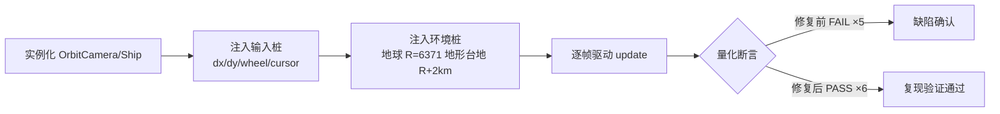

# 问题复现文档（R7 · 2026-06-11）

## 1. 复现环境

- OS：Windows 11 Pro 10.0.26200
- Node：v24（three 0.165 经 node_modules ESM 直接导入）
- 复现方式：**无浏览器代码级复现** —— Node 直接实例化 `OrbitCamera` 与 `Ship`，注入输入桩与环境桩，逐帧驱动 `update()`，量化断言缺陷行为。
- 复现脚本：`tools/repro-r7.mjs`（修复前 FAIL = 复现证据；修复后同一脚本必须全 PASS）

## 2. 复现流程

## 3. 复现步骤与结果（修复前，多次运行结果一致 ✅ 稳定复现）

执行 `node tools/repro-r7.mjs`：

| # | 断言（= 预期行为） | 实际行为（缺陷证据） | 结论 |
|---|--------------------|----------------------|------|
| 1a | 滚轮拉近应能降至地形面上 1.7m 视高 | 悬停下限 = 地面上方 **24,484 m**（`minDist = R×1.004+1`，与地形无关）→ 按 G 登陆瞬移 24km，severe 出戏 | ❌ 复现 |
| 1b | enterWalk 应保留当前视向俯仰（注入 -0.7 rad 下俯视角） | `w.pitch = 0.000`（硬编码清零，视线跳变） | ❌ 复现 |
| 2 | 行走时鼠标右移（dx>0）应向右看（yaw 增大） | yaw = **-0.66**（向左转，与探索模式方向相反） | ❌ 复现 |
| 3a | 单帧 600px 尖峰输入（Chrome 指针锁定已知尖峰）俯仰变化应 ≤14° | 单帧俯仰跳变 **75.6°**（无钳制无平滑 → "快速旋转"） | ❌ 复现 |
| 3b | 俯仰 360° 连续可越天顶（不得设限） | max\|pitch\| 越过 π/2 ✅（该自由度已正确，修复时必须保持） | ✅ 既有正确 |
| 6 | 滚轮放大后光标所指体固点应留在光标下（漂移 <0.02 rad） | 锚点漂移 **0.9552 rad ≈ 54.7°**（向屏幕中心漂移，未读取光标） | ❌ 复现 |

- 退出码：1（5 失败）
- 运行 3 次输出完全一致（确定性桩环境，无偶发）。

## 4. 不能在 Node 复现、以代码证据确认的项

| 项 | 证据 |
|----|------|
| #3 指针锁定尖峰来源 | `ship.js Input.mousemove` 对 `e.movementX/Y` 直接累加，无任何钳制；Chromium 指针锁定建立瞬间 movement 可达数百 px（已知行为） |
| #4 外行星贴图低清 | 资产体积：`uranus.jpg 0.07MB / neptune.jpg 0.23MB / pluto.jpg 0.26MB / saturn.jpg 1.05MB` vs `mercury.jpg 14.34MB / mars.jpg 8.01MB`（`public/textures/` 实测） |
| #5 入气无过渡 | `bodies.js` 气巨 `landable:false` → `minDist = R×1.004+1`（木星停云顶上 280km）；`scene.fog` 只作用于 `fog:true` 的地形材质，行星/大气着色器不受雾影响 |
| #8 未选独显 | `main.js:31` `new THREE.WebGLRenderer({...})` 未传 `powerPreference` |

## 5. 复现结论

✅ **全部问题已确认**：5 项可量化缺陷在确定性桩环境下 100% 稳定复现；3 项环境/资产类问题以代码与资产证据确认。修复后必须以同一脚本 `node tools/repro-r7.mjs` 验证全 PASS（含 3b 既有正确行为不回归）。

---

# R8 复现记录（2026-06-11）

- 复现脚本：`tools/repro-r8.mjs`（Node 驱动 OrbitCamera）；修复前 3 FAIL / 修复后 5 PASS（多次运行一致）。
- 量化证据：倾斜 0.7 rad 缩放 → 居中目标最大偏离 **119.3°**；右键平移居中后缩放 → 目标甩到身后 **180°**（相机向轨道锚点收敛并飞越）。
- 大气双边界/圆圈线：视觉问题，以截图取证 —— `r8-before-{saturn-4.5x, saturn-2.2x, jupiter-4x}.png`（木星周围灰盘圆圈线、土星极区辉光与压扁轮廓错位清晰可见），修复后同机位 `r8-after-*.png` 对照。
