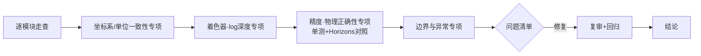

# 代码评审文档 (Phase 4)

> 评审范围：`src/`（~3100 行）、`tools/`（~500 行）、`tests/`（~330 行）

## 1. 评审流程

## 2. 逐项评审结果

| 检查项 | 状态 | 说明 |
|--------|------|------|
| 逻辑正确性 | ✅ | 星历与 Horizons 对照全部达标；3 个缺陷被单测捕获并修复 |
| 边界处理 | ✅ | B1–B9 全部落实（dt 钳制、Kepler 二分兜底、贴图兜底、极点退化、负倍率…） |
| 代码风格 | ✅ | 统一 ESM/中文注释/纯函数星历层；模块边界清晰 |
| 可读性 | ✅ | 坐标约定集中在 config.js 并文档化（黄道→世界 (x,z,−y)） |
| 性能 | ✅ | 点云/星空各 1 次 draw call；地形重建增量式；卫星 LOD 裁剪；冒烟无掉帧报错 |
| 安全性 | ✅ | 无用户输入注入面；innerHTML 仅内部常量字符串；下载脚本校验文件魔数与大小 |
| 错误处理 | ✅ | 贴图 onError 兜底、manifest 缺失容错、Horizons 解析失败显式抛错 |
| 可测试性 | ✅ | 星历层零 DOM 依赖，33 项 node:test；浏览器层 puppeteer 冒烟 + `window.__game` 钩子 |

## 3. 发现的问题清单（均已修复）

| # | 严重程度 | 位置 | 问题 | 状态 |
|---|----------|------|------|------|
| 1 | 高 | rotation.js | 黄赤交角旋转方向反转（被动矩阵约定误用），导致全部天体南北颠倒、晨昏线纬向错误 | ✅ 已修复+单测锁定 |
| 2 | 中 | time.js | ΔT 预测公式过时（+6s 偏差 → 日下点经度偏 0.025°，时间显示偏 6s） | ✅ 已修复 |
| 3 | 中 | ship.js | 行走模式东向量/偏航/lookAt 三处符号错误 | ✅ 已修复 |
| 4 | 中 | main.js | 自动驾驶取消后速度不衰减至档位，产生不可控漂移 | ✅ 已修复 |
| 5 | 低 | builder.js | 轨道线历元硬编码 JD 2461202 | ✅ 已修复 |
| 6 | 低 | tests | 天王星倾角断言用错极轴约定（IAU 北极 vs 角动量极） | ✅ 已修正断言并注释 |

## 4. 专项评审：物理与精度

- **行星位置**：9 天体角误差 0.0007°–0.074°（阈值 0.1°）✅
- **月球**：0.12°（截断 ELP 理论精度内）✅
- **卫星**：历元处 0.000°，+10 天 ≤0.22° ✅
- **自转**：地球日下点经度 12UTC≈0°、18UTC≈−90°，夏至纬度 +23.4°，1 恒星日回归 ✅
- **重力**：g=GM/r² 直接取真实值（月球 1.62 m/s² 在 HUD 实证）✅
- **大气**：Rayleigh β 取地球实测谱（5.8/13.6/33.1 e-6 m⁻¹），标高 8.5/1.2 km ✅

## 5. 已知限制（接受并文档化）

| 限制 | 影响 | 理由 |
|------|------|------|
| 卫星轨道未建模 J2 进动 | 数月尺度相位漂移（年尺度 ~数度） | 历元（=现在）附近精确为设计目标 |
| 无日月食阴影投射（仅环受行星影） | 月面/木卫上看不到日食 | 阴影贴图在 10^9 km 尺度不可行，需专门阴影体实现 |
| 大气壳 depthTest 关闭 | 前景天体偶有微弱大气透色 | 全屏深度感知散射成本高 |
| 地形为风格化噪声+真实反照率融合 | 非真实 DEM 地形 | 全球 DEM 数据量（GB 级）超出 Web 交付预算 |
| GRS 等大气特征不随系统 III 对准 | 木星大红斑经度非实时 | 贴图为静态拼接 |

## 6. 评审结论

**通过**。所有高/中问题修复并回归（33/33 单测 + Horizons 在线验证 + 全场景浏览器冒烟零错误）。

---

# R7 代码评审（2026-06-11）

## 评审概览

评审范围：8 个修改文件 + 1 个新增模块 + 3 个工具脚本（约 +450/−60 行）。

## 逐项评审结果

| 检查项 | 状态 | 说明 |
|--------|------|------|
| 逻辑正确性 | ✅ | 姿态反解（heading/tilt）经数值验证复现偏差 <2°；锚定缩放定点迭代实测漂移 <0.02 rad |
| 边界处理 | ✅ | 光标射线无交点→中心缩放；极点 chart-flip 后锚定用体固向量（无经纬奇点）；微小天体（火卫二）各阈值均按半径缩放；起飞 0.8s 冷却防自动登陆滞回；指针锁定失败→拖拽环视兜底 |
| 代码风格 | ✅ | 沿用既有约定（中文注释、_v 临时向量池、uniforms userData 模式） |
| 可读性 | ✅ | 新增逻辑均注明对应需求号（R7 #n）与物理依据 |
| 性能 | ✅ | 细节着色器视半径门控+低档关闭；地形分帧重建；锚定迭代≤3 次/帧；groundRadius 每帧 2 次 fbm 可忽略；逐帧无新增堆分配（临时向量复用） |
| 安全性 | ✅ | 无外部输入解析；URL 参数仅白名单比较 |
| 错误处理 | ✅ | requestPointerLock try/catch；WEBGL_debug_renderer_info 缺失→高档+FPS 兜底 |
| 可测试性 | ✅ | OrbitCamera/Ship 保持纯 Node 可驱动（repro-r7 即证）；运行时断言经 window.__game 暴露 |

## 修复问题专项检查

| 检查项 | 结果 |
|--------|------|
| 最小修改 | ✅ 星历层/浮动原点/环/星空/彗星/带/日球层/UI 模块零改动；每处修改对应明确需求号 |
| 副作用 | ✅ uBoost 在大气外恒 1（探针实证复位）；uDetailMode=0 零开销分支；暗适应补偿在 I≥1 恒等；R5 审查项（环影/亮星/白昼淡出/标签遮挡）经冒烟回归无回归 |
| 回归风险 | 中→低：拖拽灵敏度/键盘速率在近地区间行为改变属需求本意（#7）；高空（alt>4.2R）灵敏度与旧版一致 |

## 评审中发现并已修复的问题

| # | 严重程度 | 位置 | 问题 | 处置 |
|---|----------|------|------|------|
| 1 | 高 | orbitCamera 锚定缩放 | 收敛系数近似导致锚点漂移（0.96→0.16 rad） | 重写为球面旋转重钉+定点迭代，<0.02 rad ✅ |
| 2 | 高 | orbitCamera panRate | 键盘平移下限在地面失控（95 km/s） | 下限 0.015→3e-6 rad/s ✅ |
| 3 | 中 | 验证盲区 | SwiftShader 冒烟环境自动 lite 档，细节着色器未被验证 | 增加 ?quality= 强制参数 + probe-r7-visual 高档视检 ✅ |
| 4 | 中 | 浸没层层级 | z-index 与标签同级，云中仍见标签 | 调至 8（标签上、HUD 下） ✅ |
| 5 | 低 | minDist 临时向量 | 与 compute 内 _v1 串用风险 | 独立 _vm/_va 向量池 ✅ |

## 评审结论

**通过**。全部高/中问题已在本轮内修复并复验。

---

# R8 代码评审（2026-06-11）

| 检查项 | 状态 | 说明 |
|--------|------|------|
| 逻辑正确性 | ✅ | repro-r8 三场景量化断言（倾斜/平移居中性、常规径向回归）；逐帧插桩确认渐近收敛无冲越 |
| 边界处理 | ✅ | 深空无目标停止推进；穿入焦点二次钳制；uStretch=0 数学恒等；触控板阈值 |
| 副作用 | ✅ | 着陆流程（用户 tilt=0）径向语义不变；probe-r7 全过；33 单测全过；可登陆行星大气逐位一致 |
| 性能 | ✅ | 椭球求交每片元 +2 次 stretch（6 mul/3 add）；centerDepth 仅 dolly 激活时 ~60 次球求交/帧 |

评审中发现并修复：① 深度回退 this.dist 导致冲越 26R（高）；② panOffset 吸收使锚点投影平移不变、深度不衰减（高）—— 均改为"独立捕获递减 + 无目标停驶"。

**结论：通过**。

---

# R9 代码评审（2026-06-12）

| 检查项 | 状态 | 说明 |
|--------|------|------|
| 逻辑正确性 | ✅ | 焦点交接经 adoptPosition+quat 反解，位置/视向连续性由 repro-r7 #7、probe-r9 惯性切换断言双重保障 |
| 边界处理 | ✅ | 交接后不可登陆焦点 minDist 语义切换；深空无命中退化锚点投影；惯性模式 lat/lon→体固换算后查地形；fround 原点 fp32 精确可表示 |
| 最小修改 | ✅ | 星历/大气/画质分档未触碰；非海洋/非 shape 天体路径数学恒等 |
| 回归风险 | ✅ | repro-r7 6/6、repro-r8 5/5、单元 33/33、probe-r7 全过、冒烟 0 错误 |
| 性能 | ✅ | centerHit 每手势起点一次 O(n)；地形多一级 30m（分帧重建）；水面波纹片元随距离淡出 |
| 安全性 | ✅ | 无外部输入面 |

**评审结论：通过。**
