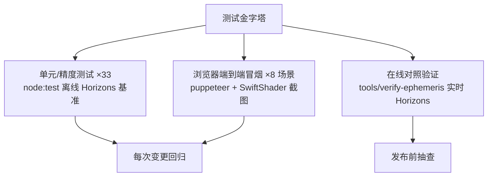
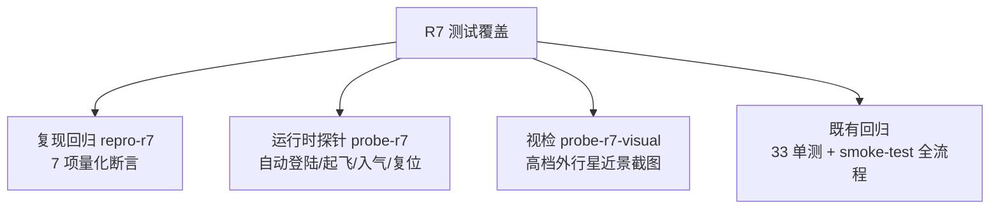

# 测试用例 (Phase 5)

## 1. 测试策略

## 2. 测试用例清单

### 单元/精度（tests/*.test.mjs，自动化）

| 用例ID | 类型 | 描述 | 输入 | 预期 | 优先级 |
|--------|------|------|------|------|--------|
| K1 | 单元 | 开普勒方程全离心率收敛 | e∈[0,0.97]×25 个 M | 残差<1e-9 | P0 |
| K2-K4 | 单元 | 圆/椭圆轨道几何、零倾角共面 | 标准根数 | 半径/近远点解析值 | P0 |
| K5 | 边界 | wrap360 归一化 | 370/-10/0 | 10/350/0 | P2 |
| E1 | 精度 | 9 天体位置 vs Horizons 基准 | JD 2461202.0 | 角差<0.1° | P0 |
| E2 | 精度 | 行星日心距离 | 同上 | 相对差<0.1% | P0 |
| E3 | 精度 | 月球地心位置 | 同上 | <0.5°, <1% | P0 |
| E4 | 精度 | 木卫一/土卫六/海卫一相对位置 | 同上 | <0.5° | P0 |
| E5 | 边界 | 1800/2050 年外推有限性 | 边界 JD | 不发散 | P1 |
| E6 | 边界 | 时间倒退至 1969-07-20 | 负向 JD | 地球日距≈1AU | P1 |
| R1-R3 | 精度 | 地球日下点经/纬度（12UTC/18UTC/夏至） | 真实 UTC | 0°/−90°/+23.4°（±4°/±0.5°） | P0 |
| R4-R5 | 精度 | 地球 23.44°/天王星 82.2°(IAU)+逆行 | J2000 极轴 | 实测倾角 | P0 |
| R6 | 单元 | 旋转矩阵正交 det=+1 | 5 天体 | <1e-9 | P1 |
| R7 | 精度 | 1 恒星日子午线回归 | +0.99727d | cos>0.99996 | P0 |
| T1-T7 | 单元 | JD 往返/J2000/ΔT/倍率/暂停/负倍率/setNow/范围判断 | — | 解析值 | P0 |
| P1 | 物理 | 地/月/火表面重力 | GM,R | 9.81/1.62/3.71 ±0.03 | P0 |
| P2 | 精度 | 8 颗卫星周期 vs 文献 | 拟合根数 | ±0.5% | P0 |
| P3 | 单元 | 卫星一周期回归 | +P 天 | <1% | P1 |
| P4 | 物理 | 海卫一逆行 | 法向 | z<0 | P1 |
| P5-P7 | 单元 | 卫星数据完备/噪声确定性有界/种子隔离 | — | — | P1 |

### 端到端冒烟（tools/smoke-test.mjs，自动化截图）

| 用例ID | 场景 | 验证点 | 优先级 |
|--------|------|--------|--------|
| S1 | 启动加载 | 贴图加载进度→开始按钮出现 | P0 |
| S2 | 地球出生点 | 仿真时间=系统时间、HUD 三面板、地球昼侧渲染 | P0 |
| S3 | 选目标+自动驾驶 | 数字键选木星、T 启动、速度爬升至百倍光速、剩余距离递减 | P0 |
| S4 | 时间加速 | 6 档加速 2 秒推进约 2 天、N 回到现在 | P0 |
| S5 | 月球抵近 | 传送月面 5km、最近天体=月球 | P0 |
| S6 | 月面登陆行走 | G 切换、模式=行走、重力=1.62 m/s²、地形地平线 | P0 |
| S7 | 行走+跳跃 | W 前进、Space 跳跃不穿地 | P0 |
| S8 | 土星环 | 环渲染、行星本影投环、暖色调、银河背景 | P1 |
| S9 | 全程零 console 错误 | errors.length==0 | P0 |

### 在线验证（tools/verify-ephemeris.mjs）

| 用例ID | 描述 | 预期 |
|--------|------|------|
| V1 | 实时调用 JPL Horizons 对照 9 天体+月球 | 全部 ✅（行星<0.1°，月球<0.5°） |

### 回归用例

| 用例ID | 对应缺陷 | 验证 |
|--------|----------|------|
| RG1 | 黄赤交角方向（缺陷#1） | R1-R5 锁定 |
| RG2 | ΔT 偏差（缺陷#2） | T3 锁定（69.184s） |
| RG3 | 卫星速率漂移（缺陷#7） | P2 周期断言锁定 |
| RG4 | 自动驾驶残速（缺陷#4） | S3 后续场景速度可控（S5 传送前提） |

---

# R7 测试用例（2026-06-11）

| 用例ID | 类型 | 描述 | 输入 | 预期 | 优先级 |
|--------|------|------|------|------|--------|
| R7-U01 | 复现 | 滚轮降至地形面 1.7m 视高 | distTarget→1，600 帧收敛 | alt=1.7m±0.5m | P0 |
| R7-U02 | 复现 | enterWalk 保留俯仰 | 构造 pitch=-0.7 视向入走 | walk.pitch≈-0.7±0.06 | P0 |
| R7-U03 | 复现 | 行走鼠标方向 | dx=10×30 帧 | yaw>0（向右看） | P0 |
| R7-U04 | 复现 | 尖峰防快速旋转 | 单帧 dy=-600 | Δpitch≤0.25 rad | P0 |
| R7-U05 | 复现/回归 | 俯仰 360° 无钳制 | 持续上仰 400 帧 | max\|pitch\|>π/2 | P0 |
| R7-U06 | 复现 | 指针锚定缩放 | 光标 ndc(0.22,0.18) 缩放至 0.33× | 锚点漂移<0.02 rad | P0 |
| R7-U07 | 单元 | 接管姿态连续 | adoptPosition(quat) | 视向偏差<2° | P0 |
| R7-B01 | 集成 | 滚轮贴地自动转行走（火星） | 浏览器压 distTarget=1 | mode=walk，pitch 连续 | P0 |
| R7-B02 | 集成 | 行走滚轮后退起飞 | wheel+1 | mode=orbit | P0 |
| R7-B03 | 集成 | 木星入气浸没 | distTarget=R×1.0013 | 浸没层 opacity>0.3、uBoost>5、保持 orbit、HUD 提示 | P0 |
| R7-B04 | 集成/回归 | 离开大气复位 | distTarget=R×5 | uBoost=1（精确） | P0 |
| R7-B05 | 视检 | 外行星高档近景 | ?quality=high 截图 ×5 | 湍流细节/临边昏暗/暗适应亮度 | P1 |
| R7-R01 | 回归 | 星历精度 | npm test | 33/33 | P0 |
| R7-R02 | 回归 | GE 全流程冒烟 | smoke-test.mjs | 全部 ✅、0 控制台错误 | P0 |
| R7-R03 | 回归 | 生产构建 | npm run build | 成功 | P1 |

---

# R8 测试用例（2026-06-11）

| 用例ID | 类型 | 描述 | 预期 | 优先级 |
|--------|------|------|------|--------|
| R8-U01 | 复现 | 倾斜 0.7 rad 滚轮缩放，居中目标全程偏离 | <0.03 rad（修复前 119.3°） | P0 |
| R8-U02 | 复现 | 倾斜缩放确实接近目标 | 剩余 <60%（修复前 235% 冲越） | P0 |
| R8-U03 | 复现 | 右键平移居中后滚轮缩放 | 偏离 <0.03 rad（修复前 180°） | P0 |
| R8-U04 | 回归 | 无倾斜无平移径向缩放 | dist 收敛且 lat/lon 不变 | P0 |
| R8-V01 | 视检 | 土星 4.5R/极区 2.2R、木星 4R 大气边界 | 无外圈亮盘、辉光贴合压扁轮廓 | P0 |
| R8-R01..03 | 回归 | repro-r7 / probe-r7 / smoke + 33 单测 + build | 全绿 | P0 |
