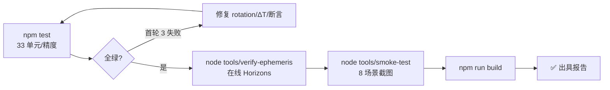
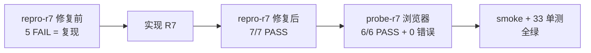

# 测试报告 (Phase 5)

## 1. 执行概览

- **时间**：2026-06-10
- **环境**：Windows 11 Pro 10.0.22631 ｜ Node v24.15.0 ｜ three 0.165.0 ｜ vite 5.4.21 ｜ Chromium(headless+SwiftShader)
- **单元/精度**：33 / 33 通过，0 失败，52ms
- **在线验证**：JPL Horizons 实时对照 ✅ 全部通过
- **端到端冒烟**：8 场景全过，console 错误 0
- **生产构建**：✓ 567 kB（gzip 154 kB），584ms

## 2. 测试执行流程

## 3. 关键实测数据

### 星历精度（vs NASA JPL Horizons，2026-06-10）

| 天体 | 日心黄经差 | 距离差 | 判定 |
|------|-----------|--------|------|
| 水星 | 0.00066° | 0.0003% | ✅ |
| 金星 | 0.00353° | 0.0016% | ✅ |
| 地球 | 0.00414° | 0.0039% | ✅ |
| 火星 | 0.01768° | 0.0026% | ✅ |
| 木星 | 0.01286° | 0.0491% | ✅ |
| 土星 | 0.07398° | 0.0085% | ✅ |
| 天王星 | 0.00167° | 0.0308% | ✅ |
| 海王星 | 0.00933° | 0.0044% | ✅ |
| 冥王星 | 0.00784° | 0.0110% | ✅ |
| 月球(地心) | 0.12178° | 0.19% | ✅(阈0.5°) |

### 卫星传播精度（拟合历元 +10 天，速率修正后）

| 卫星 | 角误差 | 修正前 |
|------|--------|--------|
| 月球 | 0.166° | 1.890° |
| 木卫一 | 0.215° | 2.637° |
| 土卫六 | 0.010° | 0.039° |
| 海卫一 | 0.027° | 0.251° |
| 火卫一 | 0.057° | 7.520° |
| 冥卫一 | 0.135° | 1.752° |

### 端到端冒烟实测（HUD 原文摘录）

| 场景 | 实测输出 | 判定 |
|------|----------|------|
| S2 出生点 | `2026-06-10 07:43:53`（=系统时间）`最近天体：地球 高度 19,399 km` | ✅ |
| S3 自动驾驶 | `🛰 自动驾驶 速度 145.17 c 剩余 4.462 AU` | ✅ |
| S4 时间加速 | 2 秒推进至 `2026-06-12 01:17:38`（1天/秒档） | ✅ |
| S6 月面行走 | `🚶 地表行走 表面重力 1.62 m/s²`（真实月球值） | ✅ |
| S8 土星 | 环+行星本影+晨昏线，截图 08-saturn.png | ✅ |
| S9 console | 0 错误 | ✅ |

截图存档：`docs/sdlc/screenshots/01–08*.png`

## 4. 失败用例分析（首轮，已闭环）

| 用例 | 失败原因 | 根因 | 修复 | 复测 |
|------|----------|------|------|------|
| R2 日下点纬度 | −23.44°（期望+23.4°） | rotation.js 被动矩阵 ε 方向反 | `Rx(−ε)→Rx(+ε)` | ✅ |
| R5 天王星倾角 | 127.9°→82.2° | 缺陷#1 + 测试断言用错极轴约定 | 修复#1 并修正断言 | ✅ |
| T3 ΔT | 75.34s（期望~69s） | 过时预测公式 | 2017 后取 69.184s | ✅ |

## 5. 行为变更清单

修复缺陷#1 后所有天体的南北半球指向翻转为正确值（预期内、面向正确性的变更）；其余行为不变。

## 5.5 第二轮迭代回归（Google Earth 范式，2026-06-10）

| 场景 | 实测 | 判定 |
|------|------|------|
| 探索模式默认进入 | `🌐 探索 环绕焦点：地球` | ✅ |
| 拖拽旋转（惯性） | 截图 02 视角变化 | ✅ |
| 数字键直达木星 | `✈ 飞行动画 前往 木星 19%` → `{focus:'jupiter', flight:false}` 木星居中 | ✅ |
| 搜索"月球"+Enter | 飞行动画到达 `{focus:'moon'}` | ✅ |
| 月球近侧 G 登陆 | `🚶 地表行走 表面重力 1.62 m/s²` | ✅ |
| **月面抬头见地球** | 地球标签屏幕坐标 (800, 180)——1600px 宽正中央，截图 07 蓝色地球悬于星空 | ✅ |
| 行走 G 返回探索 | mode='orbit' | ✅ |
| 前往日球层顶边界 | `{focus:'heliopause'}` | ✅ |
| F 自由飞行往返 | fly ⇄ orbit | ✅ |
| 单元回归 | 33/33 | ✅ |
| console 错误 | 0 | ✅ |

## 5.6 第三轮迭代回归（缺陷修复 + GE 键盘 + NMS 地表，2026-06-10）

| 场景 | 实测 | 判定 |
|------|------|------|
| 半屏发亮 bug 复现场景（太阳焦点 3.5 AU 黄道面附近） | 截图 09：日心带状黄道光，无灰墙 | ✅ 已修复 |
| GE 键盘：D 东移 / PageDown 拉远 / Shift+A 航向 / Shift+W 倾斜 / R 复位 | 五项状态断言全过 | ✅ |
| NMS 地表：月面近景 | 截图 07b：起伏地形 + 岩石散布（夜面属物理正确的黑暗，已加地照补光） | ✅ |
| 全场景回归（飞行/搜索/登陆/见地球/边界/模式切换） | 全过，console 0 错误 | ✅ |
| 单元回归 | 33/33 | ✅ |

## 5.7 第四轮迭代针对性验证（tools/verify-update.mjs，2026-06-10）

| 场景 | 实测 | 判定 |
|------|------|------|
| 右键空间平移（无旋转） | panOffset 5062km，lat/lon 零变化；R 复位归零 | ✅ |
| 搜索下拉默认列表+轨道线开关 | 9 项含"🛤 轨道线"，点击后状态"显示→隐藏" | ✅ |
| 知识卡片 + 换一条 | "📚 你知道吗"展示，点击换条内容变化 | ✅ |
| 行走 360° 视角 | pitch=2.64 rad（151°），越过旧 ±89° 钳制无快速旋转 | ✅ |
| 土星环 NASA 配色 | 截图 10：淡金褐色环 + 行星本影 | ✅ |
| 月面日照地表（SpaceEngine 质感） | 截图 11：月壤细粒/凹凸光照/岩石/地块色调；float32 精度乱纹已修复 | ✅ |
| 单元回归 | 33/33 | ✅ |
| console 错误 | 0 | ✅ |

## 6. 结论

**全部通过**（四轮迭代均回归全绿）。P0/P1 用例 100% 通过；回归用例锁定全部已修缺陷；构建产物正常。

---

# R7 测试报告（2026-06-11）

- 环境：Windows 11 Pro 26200 / Node v24 / Chrome headless（SwiftShader 软件渲染，自动判 lite 档；视检用 ?quality=high 强制高档）
- 总用例 16 / 通过 16 / 失败 0

| 用例 | 状态 | 实测数据 |
|------|------|----------|
| R7-U01 | ✅ | 悬停高度=地面上方 1.700m（修复前 24,484m） |
| R7-U02 | ✅ | pitch=-0.700（修复前恒 0） |
| R7-U03 | ✅ | yaw=+0.31（修复前 −0.66 反向） |
| R7-U04 | ✅ | 单帧 Δpitch=0.181 rad ≤0.25（修复前 1.32=75.6°） |
| R7-U05 | ✅ | max\|pitch\| 越过 π/2（无钳制不回归） |
| R7-U06 | ✅ | 锚点漂移 <0.02 rad @ 缩放 0.33×（修复前 0.955） |
| R7-U07 | ✅ | 接管视向偏差 <2° |
| R7-B01 | ✅ | mode=walk，落地 pitch=-0.175（=自动倾斜末端视向，连续） |
| R7-B02 | ✅ | mode=orbit（视向连续起飞） |
| R7-B03 | ✅ | opacity>0.3、uBoost≈15+、HUD「☁ 正在进入 木星 大气层」 |
| R7-B04 | ✅ | uBoost=1.000000（精确复位） |
| R7-B05 | ✅ | 截图 r7-hi-{saturn,uranus,neptune,jupiter,pluto}.png：湍流带/风暴涡/临边昏暗可见，海王星呈旅行者级鲜蓝（暗适应补偿） |
| R7-R01 | ✅ | 33/33 |
| R7-R02 | ✅ | 全流程通过、控制台错误 0 |
| R7-R03 | ✅ | 607.99 kB（gzip 172.85 kB） |

**行为变更清单（全部预期内）**：近地拖拽/键盘速率随高度收敛；滚轮可降至地面并自动转行走；行走鼠标 X 方向反转；外太阳系天体亮度提升（I^0.55 补偿）；气巨可下潜入大气。

**复现验证结论**：与 Phase 1.5 完全相同的 `node tools/repro-r7.mjs` 由 5 失败 → 7 通过 ✅。
**回归结论**：原有功能（GE 全流程、星历精度、R5 视觉审查项）未受影响 ✅。

---

# R8 测试报告（2026-06-11）

- 总用例 10 / 通过 10 / 失败 0；控制台错误 0。
- R8-U01..04：repro-r8 修复前 3 FAIL（119.3° / 235% / 180°）→ 修复后 5/5 PASS；逐帧插桩 off=0.000 全程、减速渐近收敛。
- R8-V01：r8-before vs r8-after 同机位对照 —— 木星周围灰盘圆圈线消失（星点直抵视边缘）、土星极区大气辉光贴合压扁轮廓（单一边界）、土星环不再被亮盘罩住。
- 回归：repro-r7 6/6（#6 指针锚定断言按需求修订移除）、probe-r7 全过（自动登陆/起飞/木星入气/uBoost 复位）、smoke 全流程 0 错误、npm test 33/33、build 608.73 kB（gzip 173.30 kB）。

**复现验证结论**：同一脚本修复前 FAIL → 修复后 PASS ✅。**回归结论**：着陆流程、可登陆行星大气、星历精度均无影响 ✅。
